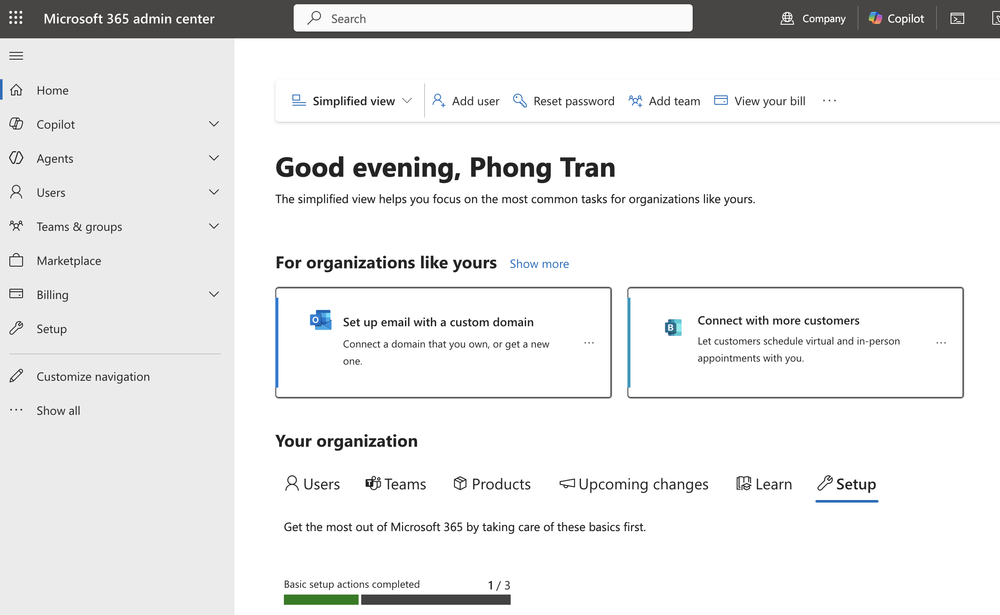
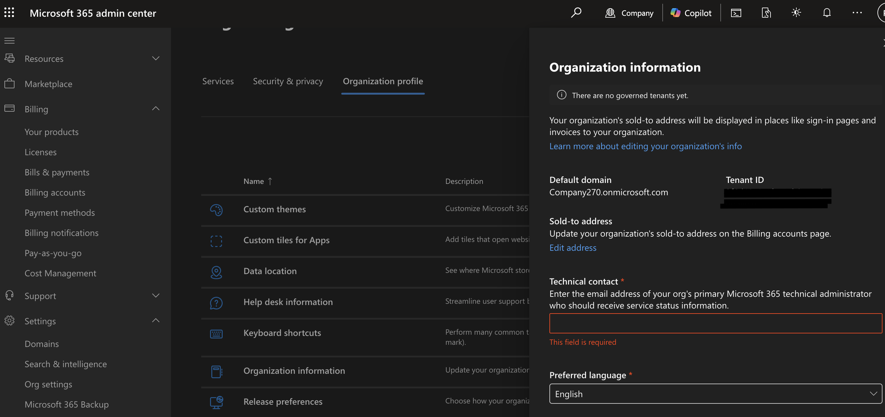
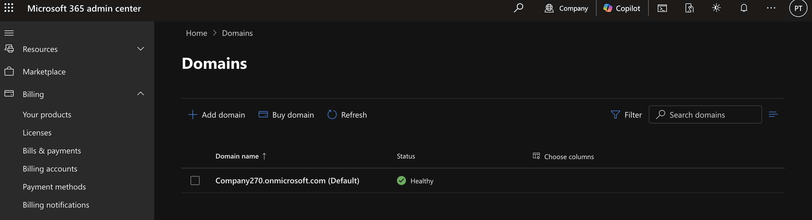
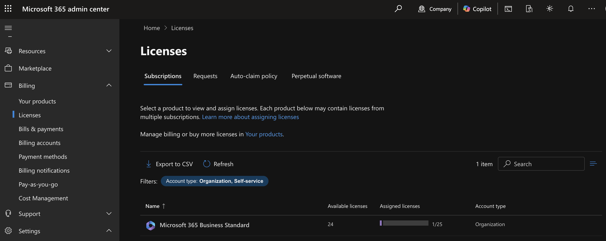

# Microsoft 365 Tenant Setup

## Objective

This lab demonstrates the initial configuration of a Microsoft 365 tenant used throughout the project.

This tenant serves as the foundation for managing users, licenses, security policies, Exchange Online, Teams, SharePoint, and other Microsoft 365 services.

---

## Prerequisites

- Microsoft 365 Developer Tenant or Trial Tenant
- Internet connection
- Administrator account
- Web browser

---

## Steps

### 1. Create a Microsoft 365 Tenant

1. Sign in to the Microsoft 365 Admin Center.
2. Create a new tenant.
3. Choose a tenant name.
4. Select your region.
5. Complete verification.
6. Sign in with the Global Administrator account.

---

### 2. Verify Organization Information

After completing the Microsoft 365 Business setup, I verified the tenant configuration in the Microsoft 365 Admin Center.

Navigation:

Settings
→ Org settings
→ Organization profile
→ Organization information

Verified:

- Organization information is accessible.
- Default tenant domain is configured.
- Tenant ID is assigned.
- Technical contact email is configured.
- Preferred language is configured.

---

### 3. Verify Default Domain

Navigation:

Settings
→ Domains

Verify:

- Default domain exists.
- Domain status is Healthy.
- Domain type is Microsoft-managed.

---

### 4. Review Licence

Navigate to:

Billing
→ Licenses

Verify:

- Available licenses
- Assigned licenses
- License type

---

### 5. Explore the Microsoft 365 Admin Center

After provisioning the tenant, I explored the Microsoft 365 Admin Center to become familiar with the administrative interface and available management areas.

The following sections were reviewed:

- Home
- Users
- Teams & Groups
- Billing
- Reports
- Health
- Settings
- Admin Centers

---

## Verification

Successfully confirmed:

- Tenant created
- Global Administrator account available
- Admin Center accessible
- Default domain verified
- Licenses available

---

## Key Takeaways

- Created a Microsoft 365 tenant.
- Verified the default domain.
- Explored the Microsoft 365 Admin Center.
- Reviewed available licenses.
- Confirmed administrative access.

