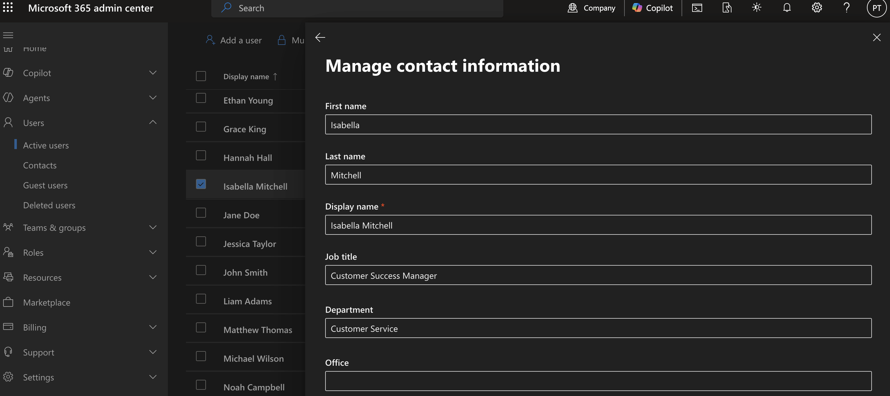
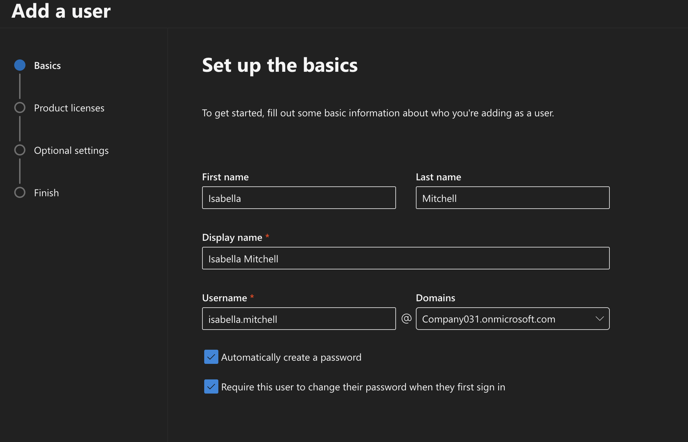
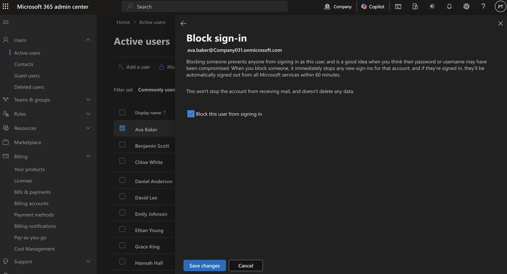

# Microsoft 365 User Management

## Objective

This lab demonstrates how to manage Microsoft 365 users by creating accounts, assigning licenses, resetting passwords, blocking sign-in, deleting users, and restoring deleted accounts.

---

## Business Scenario

An Manufacturing Pty Ltd has hired several new employees across different departments.

As the Microsoft 365 Administrator, I was responsible for provisioning user accounts, assigning the correct licenses, configuring user information, enforcing account security, and deprovisioning accounts when employees left the company.

---

## Business Requirements

- Create user accounts for new employees
- Assign Microsoft 365 Business Premium licenses
- Configure department and job titles
- Reset passwords for first login
- Block sign-in for terminated employees
- Restore accidentally deleted accounts
- Verify users can successfully sign in

---

## New Employees

| Name | Department | Job Title |
|-------|------------|-----------|
| Ava Baker | Finance | Accounts Payable Officer |
| Noah Campbell | Operations | Operations Coordinator |
| Isabella Mitchell | Customer Service | Customer Success Manager |

---

## Tasks Performed

### User Provisioning

Created Microsoft 365 accounts for all new employees using the Microsoft 365 Admin Center.

Configured:

- Display Name
- Username
- Department
- Job Title

Assigned Microsoft 365 Business Premium licenses.

---

### Password Management

Generated temporary passwords.

Enabled users to change their password during first sign-in.

This ensures each employee creates a private password before accessing company resources.

---

### Employee Offboarding

An employee resigned from the company.

Actions completed:

- Blocked sign-in

## Verification

Verify that you can:

- Create a Microsoft 365 user
- Assign a Microsoft 365 license
- Update user profile information
- Reset a user's password
- Block and unblock user sign-in
- Delete and restore a user account

---

## Key Takeaways

- Created and managed Microsoft 365 user accounts.
- Assigned Microsoft 365 licenses.
- Updated user profile and contact information.
- Reset user passwords securely.
- Blocked and restored user sign-in.
- Deleted and restored user accounts.

