# User Management

## Objective

This lab demonstrates how to manage Microsoft 365 users by creating accounts, assigning licenses, resetting passwords, blocking sign-in, deleting users, and restoring deleted accounts.

---

## Prerequisite

- Access to Microsoft 365 Admin Center

---

## Steps

### 1. Create a New User

1. Sign in to the Microsoft 365 Admin Center.
2. Navigate to **Users** → **Active users**.
3. Click **Add a user**.

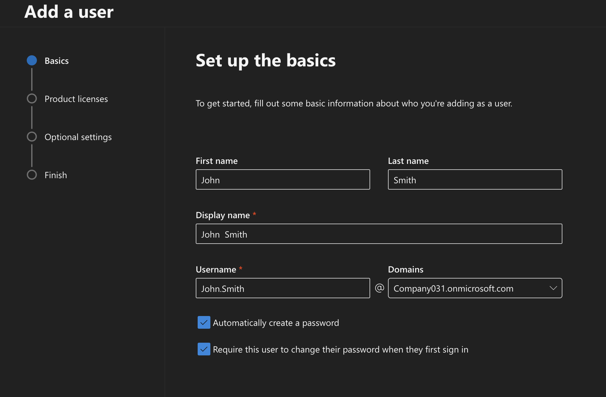

---

### 2. Assign a License

1. Select the Microsoft 365 license you want to assign to the user.
2. Click **Next**.

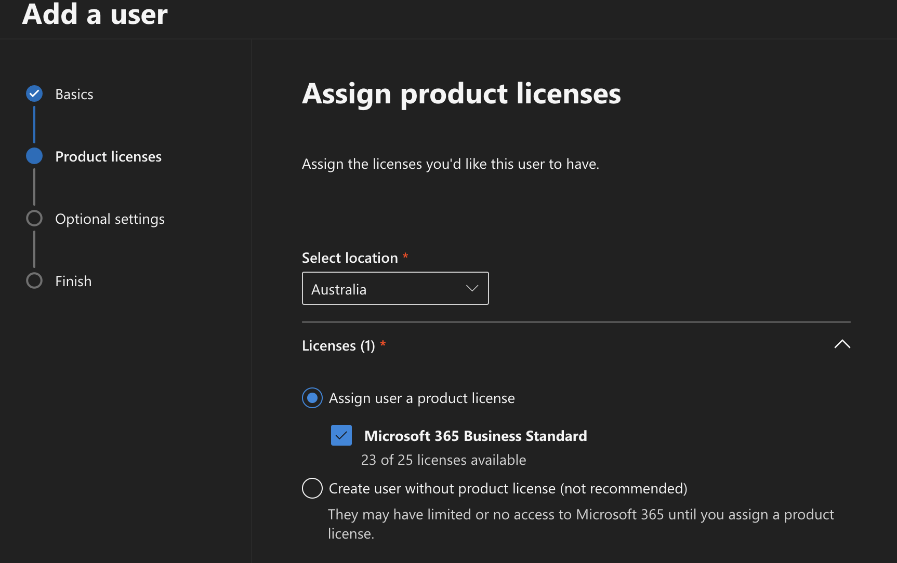

---

### 3. Configure User Profile

Enter the user's profile information, including **Job title** and **Department**. These fields are optional and can be updated later. Click **Next** to continue.

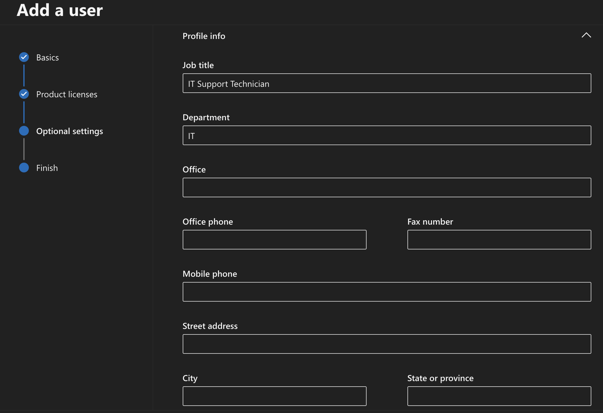

---

### 4. Review and Complete User Creation

1. Review the user details and assigned settings.
2. Click **Finish adding** to create the user.

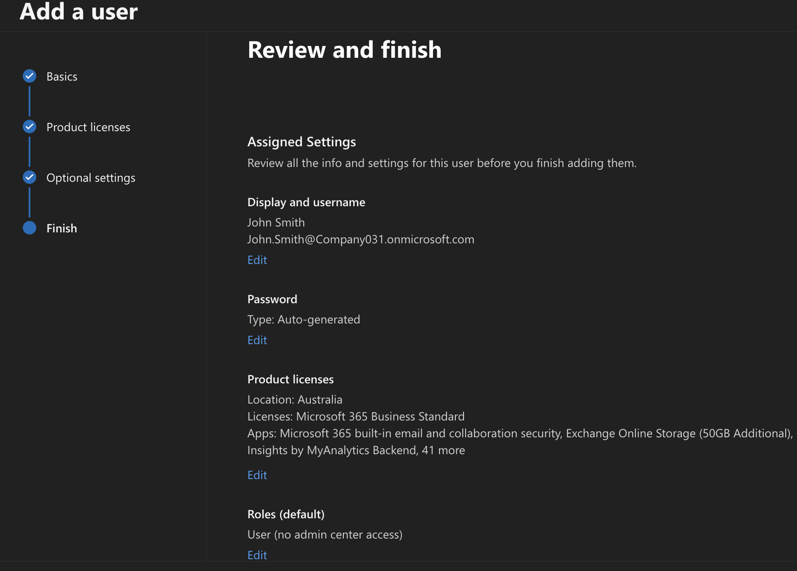

---

### 5. Verify User Creation

1. Navigate to **Users** → **Active users**.
2. Confirm that **John Smith** appears in the user list.
3. Select the user to verify the assigned license and account details.

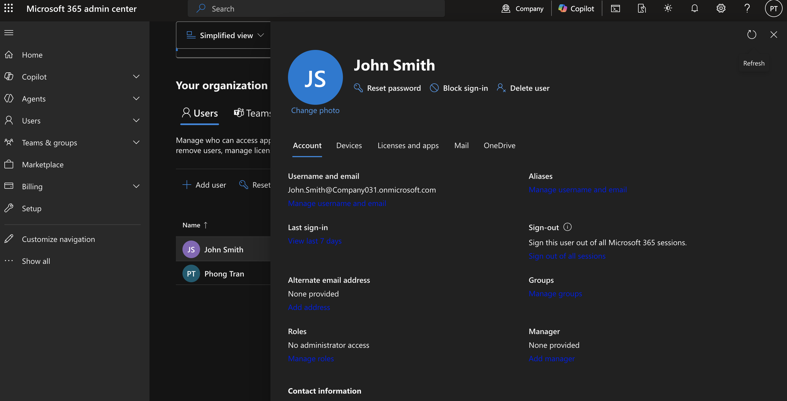

---

### 6. Reset a User Password

1. Navigate to **Users** → **Active users**.
2. Select **John Smith**.
3. Click **Reset password**.
4. Choose one of the following options:
   - **Automatically create a password**, or
   - **Create password manually**.
5. Enable **Require this user to change their password when they first sign in**.
6. Click **Reset password**.

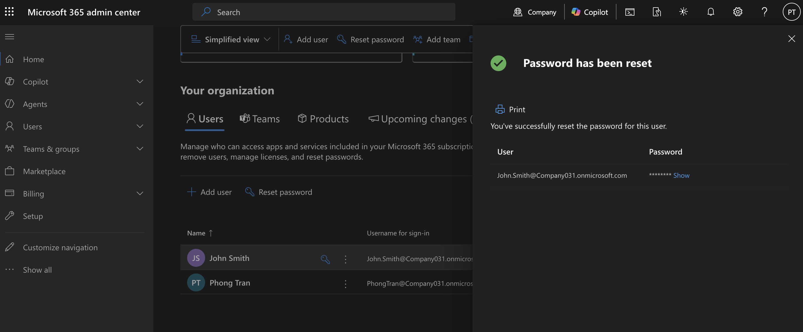

---

### 7. Update User Information

1. Navigate to **Users** → **Active users**.
2. Select **John Smith**.
3. Open the section you want to update (for example, **Contact information**, **Username and email**, or **Licenses and apps**).
4. Modify the required information.
5. Click **Save**.

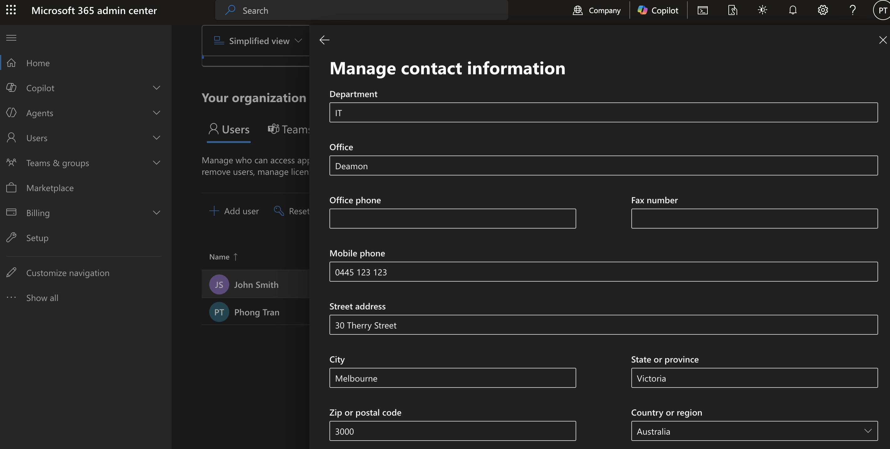

---

### 8. Block a User Sign-in

1. Navigate to **Users** → **Active users**.
2. Select **John Smith**.
3. Click **Block sign-in**.
4. Enable **Block this user from signing in**.
5. Click **Save changes**.
6. Verify that the user's sign-in status has been updated.

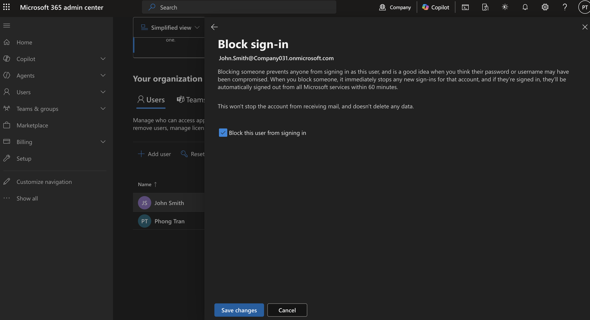

---

### 9. Unblock a User Sign-in

1. Navigate to **Users** → **Active users**.
2. Select **John Smith**.
3. Click **Unblock sign-in**.
4. Disable **Block this user from signing in**.
5. Click **Save changes**.
6. Verify that the user can sign in again.

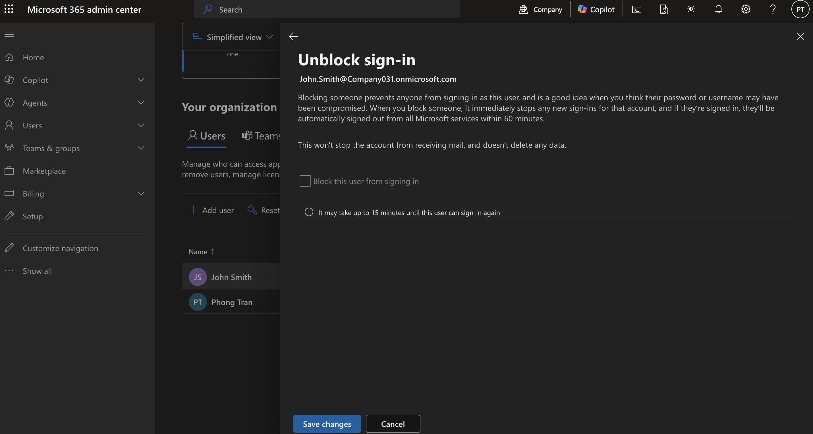

---

### 10. Delete a User

1. Navigate to **Users** → **Active users**.
2. Select **John Smith**.
3. Click **Delete user**.
4. Confirm the deletion.

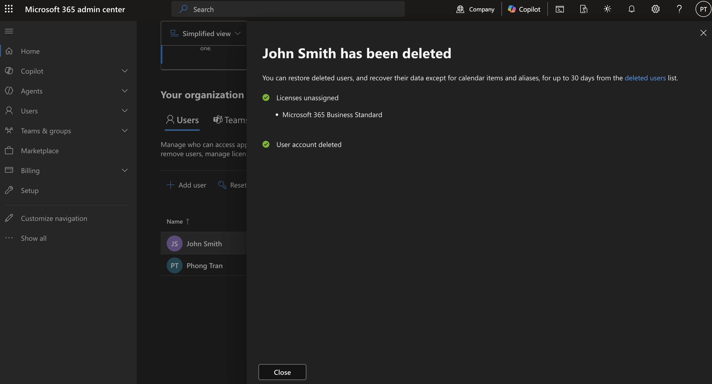

---

### 11. Restore a Deleted User

1. Navigate to **Users** → **Deleted users**.
2. Select **John Smith**.
3. Click **Restore user**.
4. Verify that the user account has been restored and appears in **Users** → **Active users**.

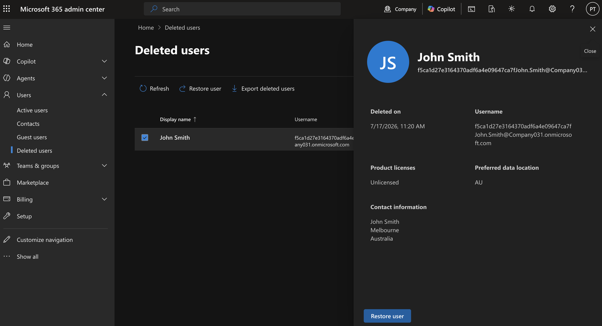

---

## Verification

Verify that you can:

- Create a Microsoft 365 user
- Assign a Microsoft 365 license
- Update user profile information
- Reset a user's password
- Block and unblock user sign-in
- Delete and restore a user account

