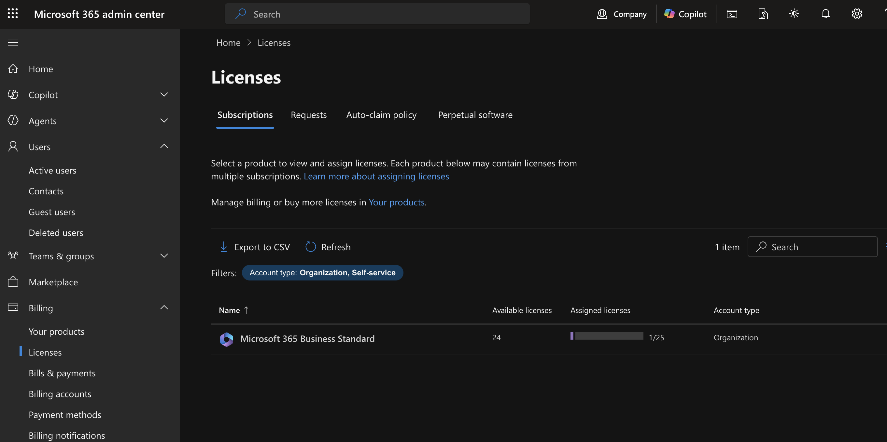
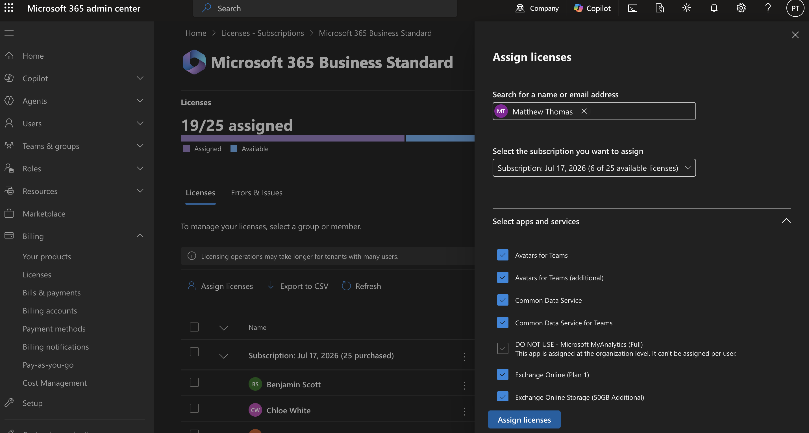
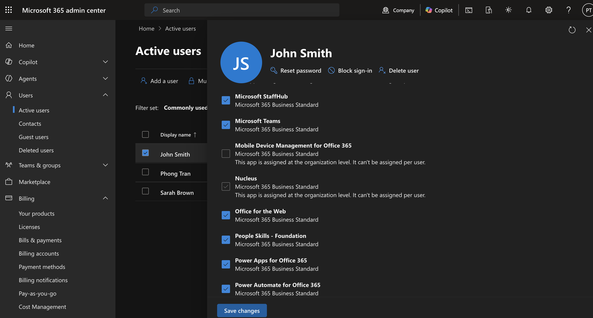
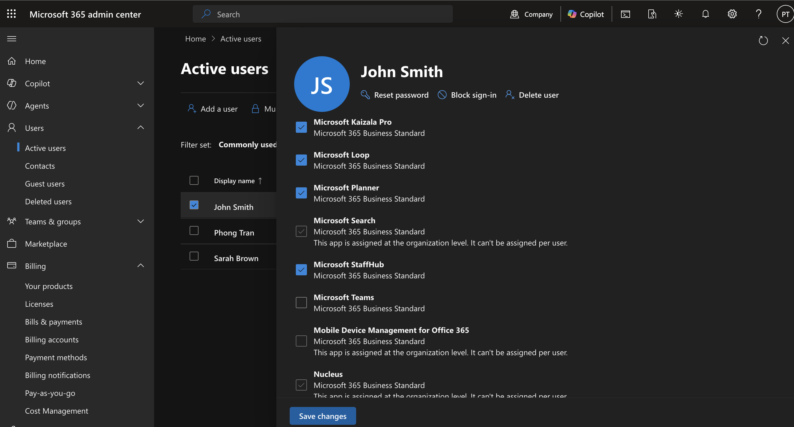
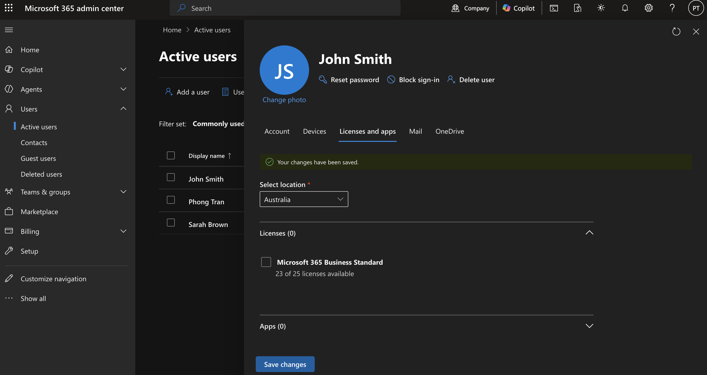
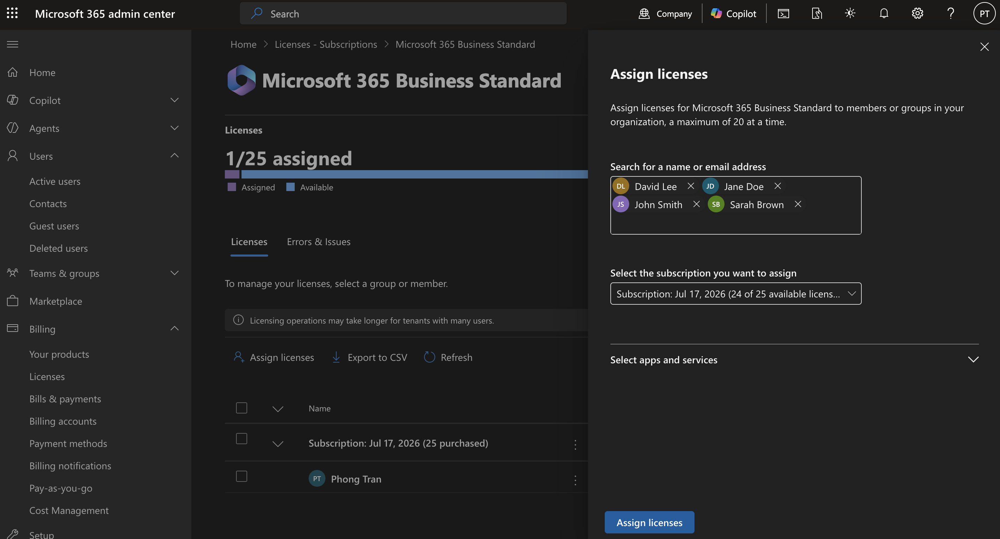

# Microsoft 365 License Management

## Objective

Demonstrate how Microsoft 365 licenses are assigned, modified, and reclaimed to ensure employees receive the correct services while minimizing licensing costs.

---

## Business Scenario

A company hired several new employees across different departments.

The HR department submitted an onboarding request to IT to provision Microsoft 365 accounts with the appropriate licenses.

---

## Business Requirements

- Assign Business licenses to office staff
- Assign Business Basic licenses to warehouse employees
- Review unused licenses
- Reclaim licenses from departed employees
- Verify license availability before onboarding additional staff

---

# Tasks Performed

# Task 1 - Review Available Licenses

### Help Desk Ticket

**Ticket:** HD-2001

**Request**

HR notified IT that five new employees will begin work next Monday. Before creating accounts, confirm that sufficient Microsoft 365 licenses are available.

### Actions Performed

- Opened Billing > Licenses
- Reviewed purchased licenses
- Checked assigned versus available licenses
- Confirmed enough licenses remained

### Business Value

Checking license availability prevents onboarding delays and avoids assigning licenses that are no longer available.

### Verification

- Available licenses displayed
- Assigned licenses matched current users

---

# Task 2 - Assign Licenses

### Help Desk Ticket

**Ticket:** HD-2002

**Request**

Assign Microsoft 365 Business licenses to newly hired office employees.

| Name | Department | Job Title |
|-------|------------|-----------|
| Matthew Thomas | Operations | Business Analyst |

### Actions Performed

- Selected user accounts
- Assigned Microsoft 365 Business
- Saved changes
- Confirmed license assignment

### Business Value

Users immediately receive access to:

- Outlook
- Teams
- OneDrive
- SharePoint
- Office applications
- Microsoft Defender

### Verification

- License status shows Active
- User can access Microsoft 365 applications

## Lab 1 - View Available Licenses

### Steps

1. Sign in to the Microsoft 365 Admin Center.
2. Navigate to **Billing** → **Licenses**.
3. Review the available subscriptions.
4. Note the total, assigned, and available licenses.

### Verification

- Microsoft 365 Business Premium is listed.
- License counts are displayed correctly.

---

## Lab 2 - Assign a License

### Steps

1. Navigate to **Users** → **Active users**.
2. Select a user.
3. Click **Licenses and apps**.
4. Enable **Microsoft 365 Business Premium**.
5. Click **Save changes**.

### Verification

- User status displays **Licensed**.
- Assigned license count increases.

---

## Lab 3 - View Included Apps

### Steps

1. Select the licensed user.
2. Open **Licenses and apps**.
3. Review the available Microsoft 365 services.

Example services include:

- Exchange Online
- Microsoft Teams
- OneDrive
- SharePoint
- Microsoft Defender
- Microsoft Intune

### Verification

- All licensed services are displayed.

---

## Lab 4 - Disable a Service

### Steps

1. Open **Licenses and apps**.
2. Expand the Microsoft 365 Business Premium license.
3. Disable **Microsoft Teams**.
4. Click **Save changes**.

### Verification

- Teams is disabled.
- Other Microsoft 365 services remain enabled.

---

## Lab 5 - Remove a License

### Steps

1. Navigate to **Users** → **Active users**.
2. Select the licensed user.
3. Open **Licenses and apps**.
4. Remove the Microsoft 365 Business Premium license.
5. Save the changes.

### Verification

- User displays **Unlicensed**.
- Available license count increases.

---

## Lab 6 - Bulk License Assignment

### Steps

1. Go to Billing → Licenses.
2. Select Microsoft 365 Business Standard.
3. Look for Assign licenses.
4. Select Microsoft 365 Business Premium.
5. Add users from there.

### Verification

- All selected users receive a license.

---

# Key Takeaways

- A single license can include multiple Microsoft 365 applications.
- Individual services can be enabled or disabled without removing the entire license.
- Licenses can be assigned to one user or multiple users simultaneously.
- Administrators should regularly monitor license availability to ensure sufficient capacity.

