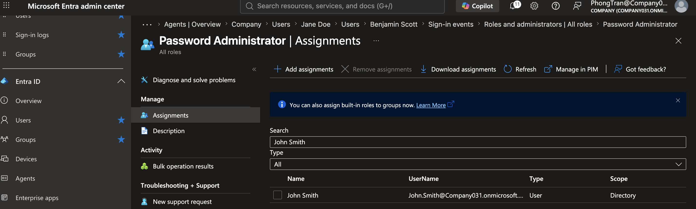

# Microsoft Entra ID Administration

## Objective 

This lab demonstrates how to use Microsoft Entra ID to manage identities, security groups, administrator roles, authentication methods, and sign-in activity within a Microsoft 365 tenant.

---

## Business Scenario

An company employs approximately 20 staff across multiple departments including:

- IT
- Human Resources
- Finance
- Sales
- Operations

Following several phishing attempts targeting employee accounts, management requested the IT department to strengthen identity security and improve access management across the Microsoft 365 environment.

As the Microsoft 365 Administrator, I was responsible for reviewing user identities, implementing security controls, monitoring authentication activity, and applying the principle of least privilege.

---

## Business Requirements

- Review user accounts and identity information
- Verify department security groups
- Enable Multi-Factor Authentication (MFA)
- Create a Conditional Access policy
- Reset compromised user passwords
- Review sign-in activity
- Assign administrator roles using the Principle of Least Privilege

---

# Task 1 - Review User Accounts

### Help Desk Ticket

**Ticket:** HD-4001

**Request**

HR recently onboarded several new employees and requested IT verify that all user accounts had been successfully created before Microsoft 365 services were assigned.

### Actions Performed

- Opened Microsoft Entra Admin Center
- Reviewed all users
- Verified account status
- Confirmed user information including department and job title
- Checked sign-in status

### Business Value

Reviewing user accounts ensures employee identities are accurate before access is granted to company resources, reducing administrative errors during onboarding.

### Verification

- All employee accounts successfully located
- User information matched HR records
- Account status 

---

# Task 2 - Review Security Groups

### Help Desk Ticket

**Ticket:** HD-4002

**Request**

The IT Manager requested verification that employees were assigned to the correct security groups to ensure department-based access to Microsoft 365 resources.

### Actions Performed

- Reviewed Security Groups
- Checked group membership
- Confirmed department assignments
- Verified group owners

### Business Value

Using security groups simplifies permission management and reduces the need to assign permissions individually.

### Verification

- Department groups displayed
- Users assigned to appropriate groups
- Group membership confirmed

---

# Task 3 - Enable Multi-Factor Authentication (MFA)

### Help Desk Ticket

**Ticket:** HD-4003

**Request**

Following multiple phishing attempts, management requested Multi-Factor Authentication be enabled for all office employees.

| Name | Department | Job Title |
|-------|------------|-----------|
| Ava Baker | Finance | Accounts Payable Officer |

### Actions Performed

- Selected target users
- Enabled Multi-Factor Authentication
- Verified MFA registration status

### Business Value

MFA significantly reduces the risk of compromised passwords being used to access company resources.

### Verification

- MFA enabled for selected users
- Authentication status displayed successfully

---

# Task 4 - Reset User Password

### Help Desk Ticket

**Ticket:** HD-4004

**Request**

A Sales employee contacted the IT Service Desk after forgetting their Microsoft 365 password and was unable to access Outlook and Teams.

| Name | Department | Job Title |
|-------|------------|-----------|
| Benjamin Scott | Sales | Sales Manager |

### Actions Performed

- Located the employee account
- Reset the password
- Required password change at next sign-in
- Provided temporary credentials

### Business Value

Password resets restore employee productivity while maintaining account security through mandatory password changes.

### Verification

- Password successfully reset
- User required to change password at next login

---

# Task 5 - Review Sign-in Logs

### Help Desk Ticket

**Ticket:** HD-4006

**Request**

The Security Team requested a review of recent sign-in activity after Microsoft reported unusual authentication attempts.

### Actions Performed

- Opened Sign-in Logs
- Reviewed successful sign-ins
- Reviewed failed sign-ins
- Examined login locations
- Checked authentication methods

### Business Value

Sign-in logs allow administrators to investigate suspicious login attempts and identify potential security incidents before they become serious threats.

### Verification

- Recent authentication activity displayed
- Successful and failed sign-ins reviewed
- Login locations verified

---

# Task 6 - Assign Administrative Roles

### Help Desk Ticket

**Ticket:** HD-4007

**Request**

A newly hired IT Support Technician requires permission to reset user passwords but should not receive full Global Administrator access.

| Name | Department | Job Title |
|-------|------------|-----------|
| John Smith | IT | IT Support Technician |

### Actions Performed

- Reviewed available administrator roles
- Assigned Password Administrator role
- Verified role assignment

### Business Value

Applying Role-Based Access Control (RBAC) limits administrative privileges and reduces security risks by following the Principle of Least Privilege.

### Verification

- Administrator role successfully assigned
- Assigned permissions displayed correctly

---

# Key Takeaways

- Microsoft Entra ID is the identity and access management service for Microsoft 365.
- Users, groups, and administrator roles are centrally managed through Entra ID.
- Security groups simplify permission management.
- Authentication methods and sign-in logs help secure user accounts and troubleshoot access issues.
- Enterprise Applications provide centralised management of applications integrated with Microsoft Entra ID.

