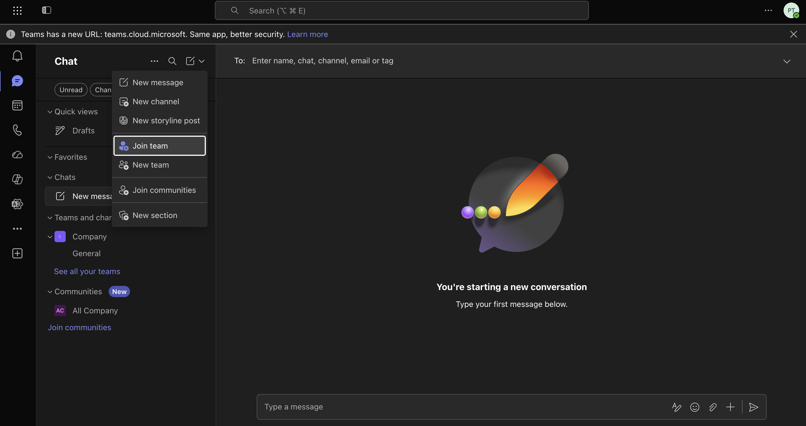
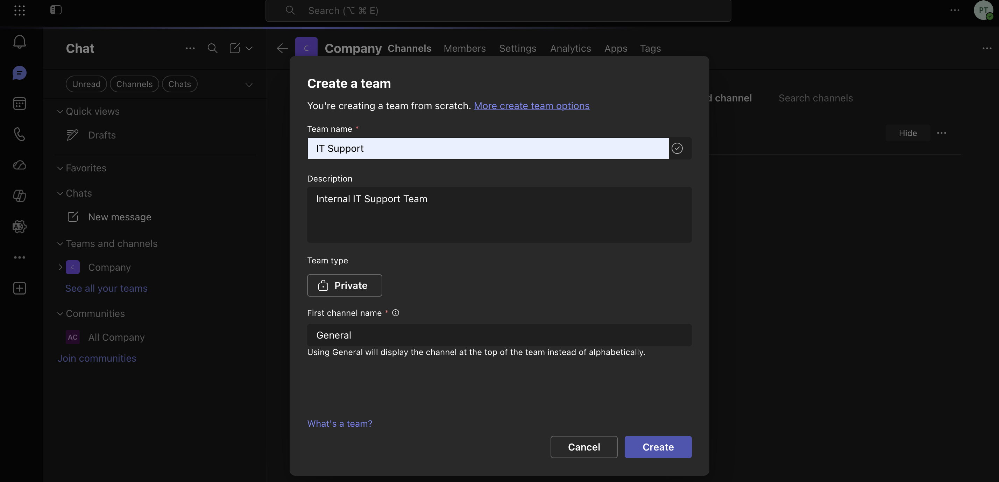
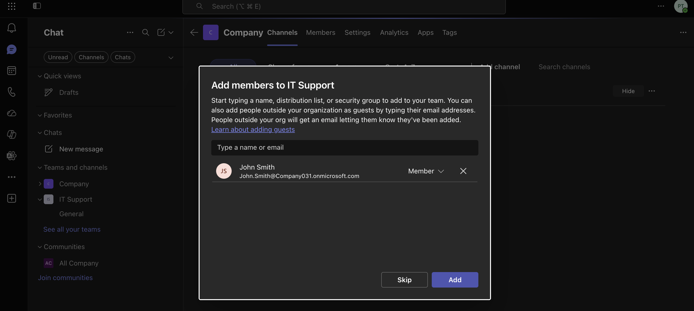
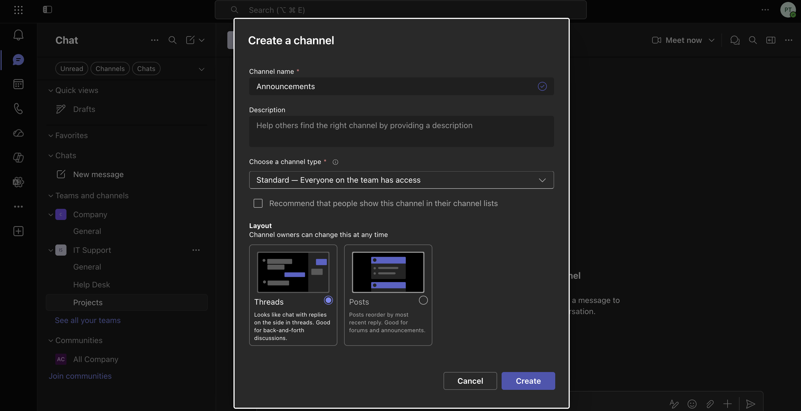
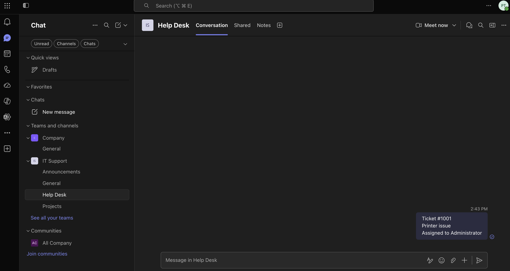
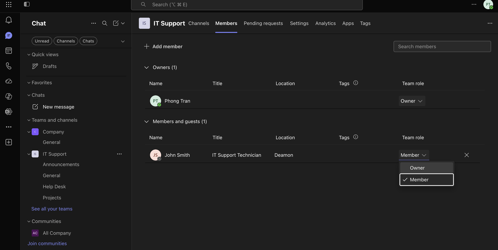
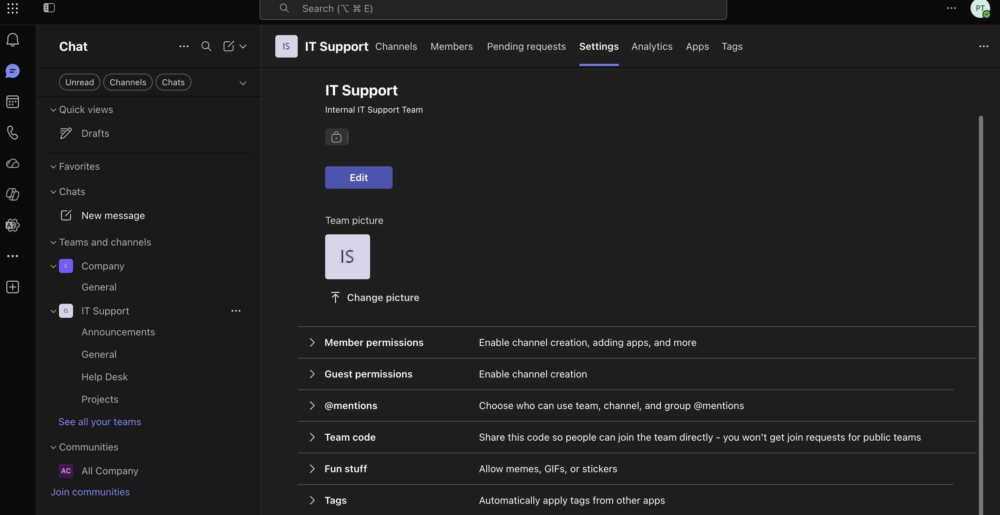
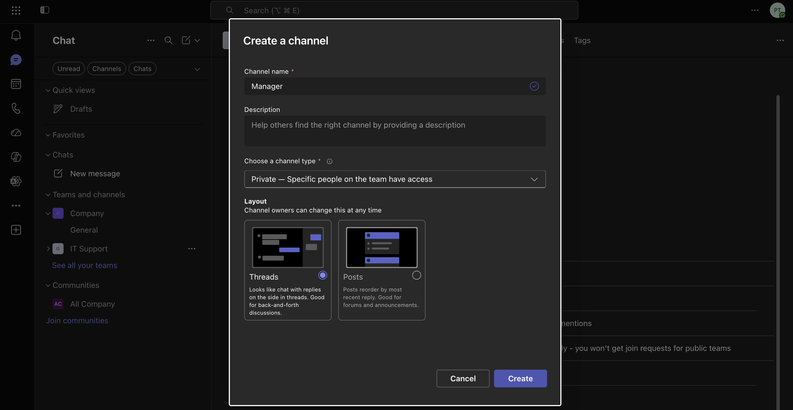
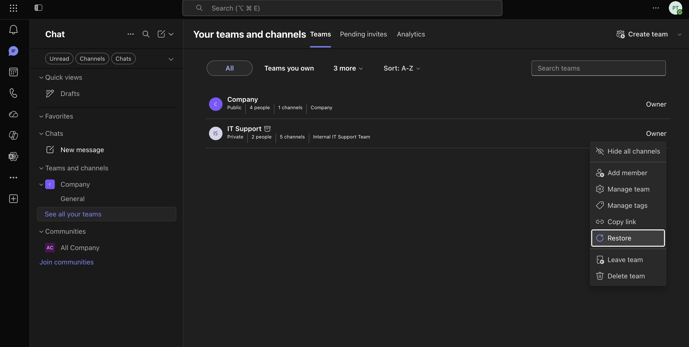

# Microsoft Teams Administration

## Objective

This lab demonstrates how to administer Microsoft Teams by creating teams, managing members, configuring channels, modifying team settings, and exploring the Microsoft Teams Admin Center.

---

## Business Scenario

An company has expanded its workforce and introduced several new departments that require secure collaboration through Microsoft Teams.

The IT department received multiple requests from different business units to prepare Teams for daily operations while ensuring employees have the correct access.


## Steps

### 1. Open Microsoft Teams

1. Sign in to the Microsoft Teams web app or desktop application.
2. Navigate to **Teams**.
3. Select **Join or create a team**.



---

### 2. Create a New Team

1. Click **Create team**.
2. Select **From scratch**.
3. Choose **Private**.
4. Enter the following details:

| Setting | Value |
|----------|-------|
| Team Name | IT Support |
| Description | Internal IT Support Team |

5. Click **Create**.



---

### 3. Add Team Members

1. Add the Test User to the team.
2. Leave the Administrator account as the Team Owner.
3. Verify both users appear in the Members list.



---

### 4. Create Channels

Create the following standard channels:

- Help Desk
- Projects
- Announcements
    
The default **General** channel is created automatically.



---

### 5. Post Messages

Create sample conversations in each channel.

For Example:

**General**

```
Welcome to the IT Support Team.
```

**Help Desk**

```
Ticket #1001
Printer issue
Assigned to Administrator
```

**Projects**

```
Microsoft 365 Administration Lab
Status: In Progress
```

**Announcements**

```
Maintenance scheduled this Friday.
```



---

### 6. Manage Team Roles

1. Open **Manage team**.
2. Promote the Test User to **Owner**.
3. Change the user back to **Member**.

This demonstrates role management within Microsoft Teams.



---

### 7. Configure Team Settings

Navigate to:

Manage Team → Settings

Modify one or more settings, such as:

- Allow members to create channels
- Allow members to delete channels
- Allow GIFs
- Allow stickers and memes

Save the changes.



---

### 8. Create a Private Channel

Create a private channel named:

```
Managers
```

Add only the Administrator account.

Verify that other members cannot access the channel.



---

### 9. Archive and Restore the Team

1. Select the Team.
2. Choose **Archive Team**.
3. Verify the team becomes read-only.
4. Restore the team.



---

## Key Takeaways

- Microsoft Teams is Microsoft's collaboration platform for communication, meetings, file sharing, and teamwork.
- Teams can be configured as either Public or Private depending on business requirements.
- Team Owners manage membership, permissions, and settings.
- Channels organize conversations by topic or department.