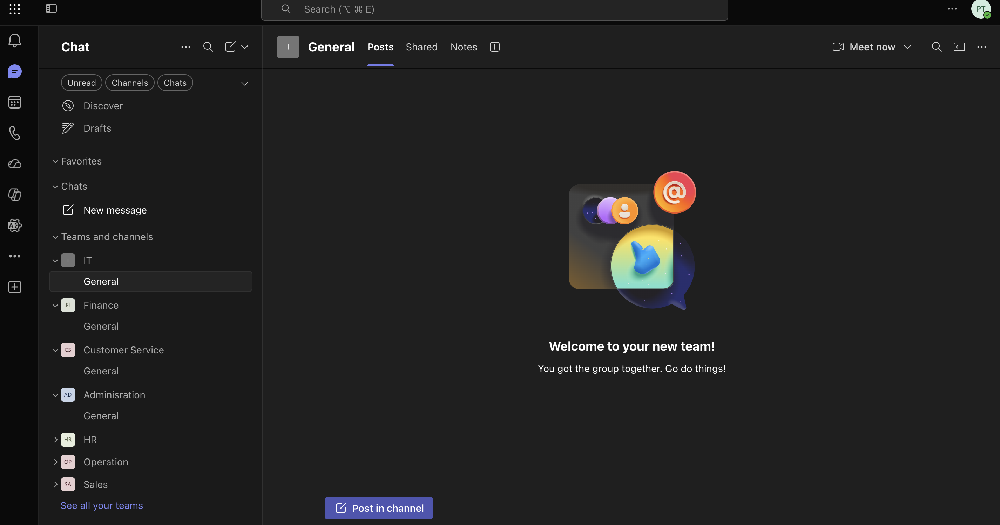
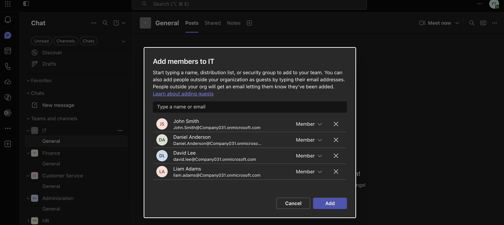
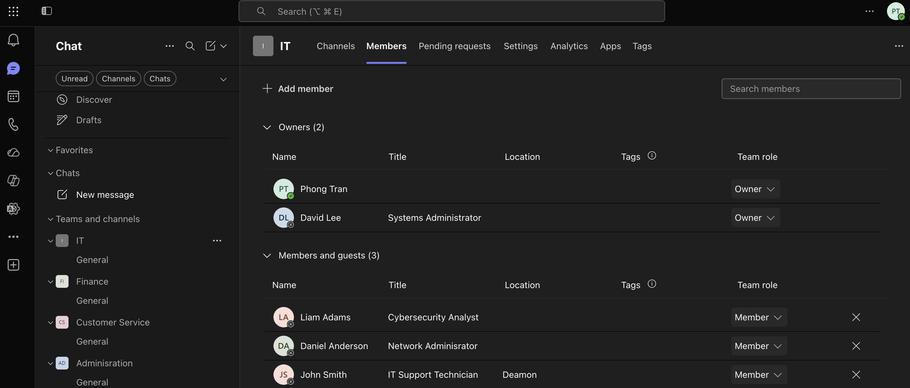
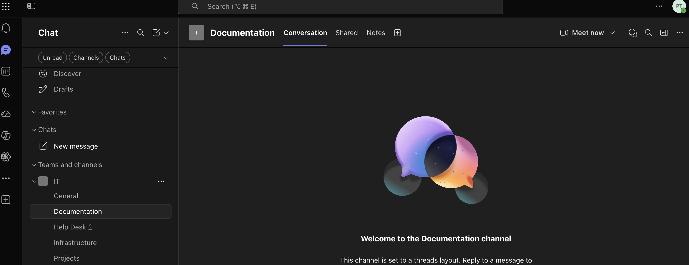
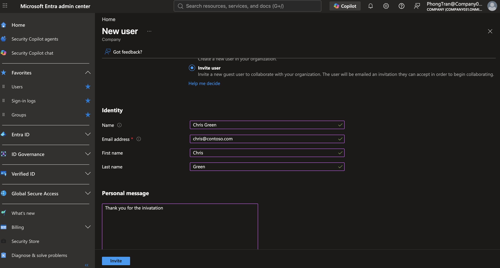
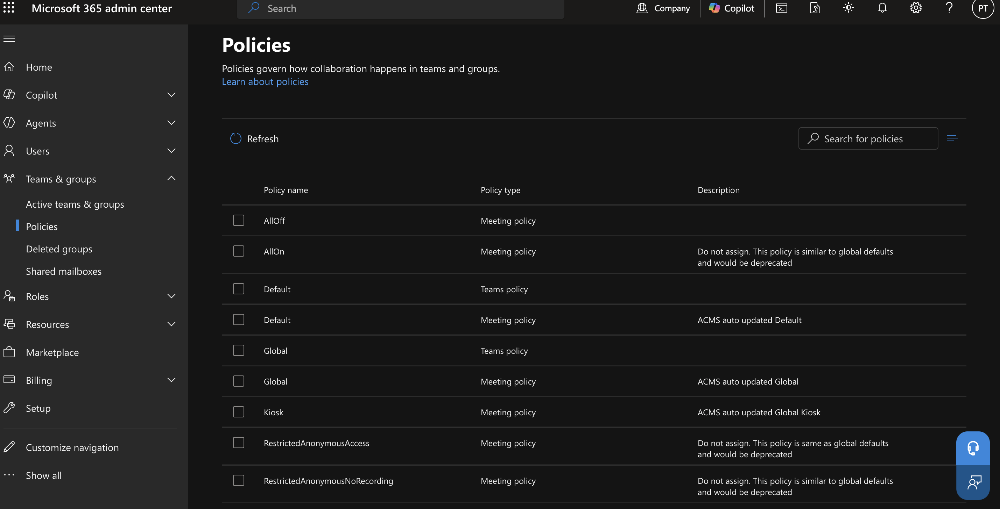
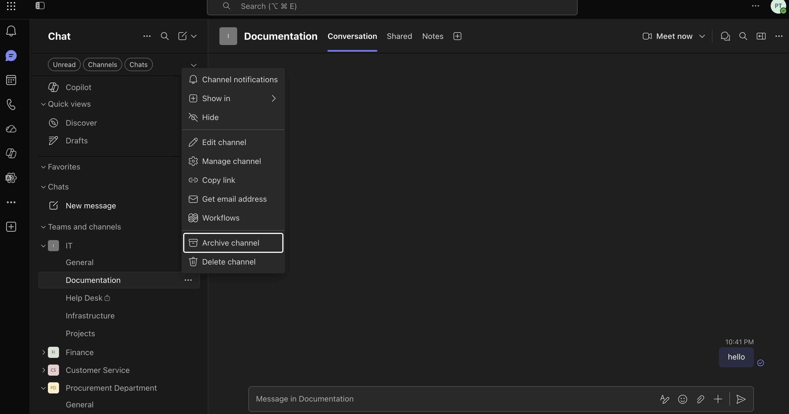

# Microsoft Teams Administration

## Objective

This lab demonstrates how to administer Microsoft Teams by creating teams, managing members, configuring channels, modifying team settings, and exploring the Microsoft Teams Admin Center.

---

## Business Scenario

An company has expanded its workforce and introduced several new departments that require secure collaboration through Microsoft Teams.

The IT department received multiple requests from different business units to prepare Teams for daily operations while ensuring employees have the correct access.

---

## Business Requirements

- Create department-specific Teams
- Add and remove team members
- Assign team owners
- Configure channels for projects
- Manage external collaboration
- Configure meeting policies
- Archive inactive Teams when projects finish

---

# Task 1 - Create Department Teams

### Help Desk Ticket

**Ticket:** HD-5001

### Request

The Operations Manager requested dedicated collaboration spaces for the IT, HR, Finance, and Sales departments before new employees begin work.

### Actions Performed

- Created separate Teams for each department
- Assigned appropriate team names
- Selected Private teams
- Assigned department managers as Team Owners

### Business Value

Creating department Teams provides employees with dedicated collaboration spaces while preventing unauthorized access to sensitive discussions.

### Verification

- Teams successfully created
- Team owners assigned
- Teams visible in Microsoft Teams

---

# Task 2 - Add Members to Teams

### Help Desk Ticket

**Ticket:** HD-5002

### Request

HR confirmed all new employees had started. Add each employee to the appropriate department Team.

### Actions Performed

- Added employees to their respective Teams
- Verified department membership
- Confirmed users could access their Team

### Business Value

Assigning employees to the correct Team ensures they immediately receive department communications, shared files, and meeting invitations.

### Verification

- Members displayed under Team membership
- Employees successfully joined their Team

---

# Task 3 - Promote Team Owners

### Help Desk Ticket

**Ticket:** HD-5003

### Request

Department managers require administrative control to manage membership and moderate conversations without contacting IT.

### Actions Performed

- Promoted department managers to Team Owners
- Confirmed Owner permissions
- Verified multiple Owners where required

### Business Value

Delegating Team management reduces the workload on IT while allowing departments to manage their own collaboration spaces.

### Verification

- Owners displayed correctly
- Managers able to administer Team settings

---

# Task 4 - Create Channels

### Help Desk Ticket

**Ticket:** HD-5004

### Request

The IT department requested separate channels for Help Desk, Infrastructure, Projects, and Documentation to better organize discussions.

### Actions Performed

- Created channels within the IT Team
- Assigned meaningful channel names
- Verified channels were available to members

### Business Value

Organized channels reduce clutter, improve collaboration, and make project information easier to locate.

### Verification

- Channels successfully created
- Members able to access each channel

---

# Task 5 - Configure External Access

### Help Desk Ticket

**Ticket:** HD-5005

### Request

The Procurement department needs to collaborate with an external supplier on an upcoming warehouse expansion project.

### Actions Performed

- Reviewed external collaboration settings
- Configured external access according to company policy
- Verified collaboration settings

### Business Value

External collaboration enables communication with trusted partners while maintaining organizational security.

### Verification

- External access configured

---

# Task 6 - Review Meeting Policies

### Help Desk Ticket

**Ticket:** HD-5006

### Request

Management requested IT to review the organization's Microsoft Teams meeting policies to ensure employees are using the approved meeting configuration.

### Actions Performed

- Navigated to Teams & groups > Policies.
- Reviewed available Microsoft Teams meeting policies.
- Confirmed the Global meeting policy was available.
- Verified default meeting policies assigned to the organization.

### Business Value

Reviewing meeting policies ensures meetings follow organizational standards for security, recording, participant permissions, and collaboration.

### Verification

- Meeting policies successfully displayed.
- Global and default meeting policies available.
- Policy types identified.

---

# Task 7 - Archive Completed Project Team

### Help Desk Ticket

**Ticket:** HD-5007

### Request

The ERP Migration project has concluded. Archive the Team so historical conversations remain available while preventing further changes.

### Actions Performed

- Archived the project Team
- Confirmed read-only status
- Verified files remained accessible

### Business Value

Archiving preserves project history for auditing and future reference without allowing unnecessary modifications.

### Verification

- Team displayed as Archived
- Members unable to post new conversations

---

## Key Takeaways

- Microsoft Teams is Microsoft's collaboration platform for communication, meetings, file sharing, and teamwork.
- Teams can be configured as either Public or Private depending on business requirements.
- Team Owners manage membership, permissions, and settings.
- Channels organize conversations by topic or department.