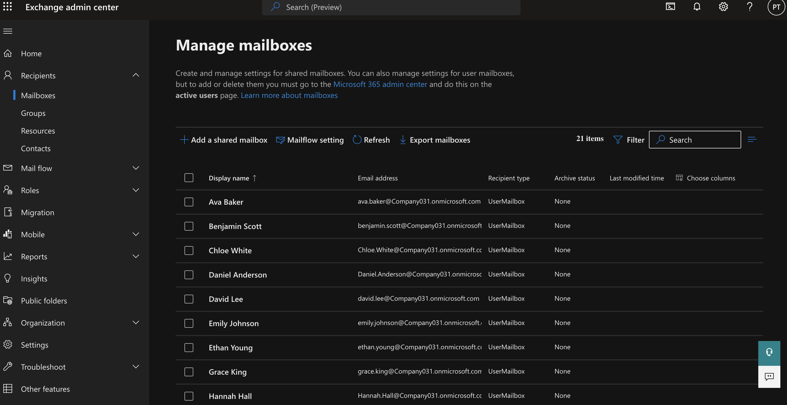
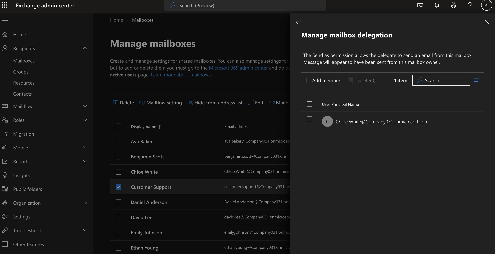
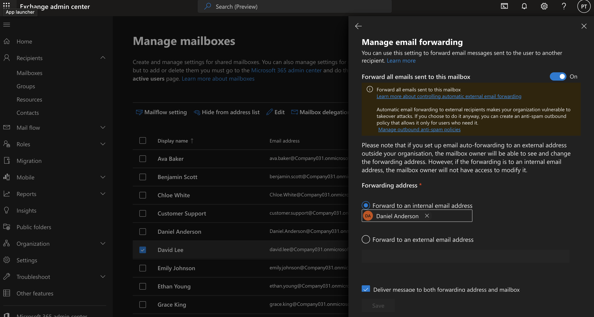

# Microsoft 365 Exchange Online Administration

## Objective

Demonstrate common Microsoft Exchange Online administration tasks used by IT administrators to manage corporate email services, improve collaboration, enhance security, and support employee requests.

---

## Business Scenario

The company recently migrated its email system to Microsoft 365 Exchange Online.

As the Microsoft 365 Administrator, IT is responsible for managing employee mailboxes, supporting departmental collaboration, ensuring emails are delivered successfully, and responding to help desk requests.

---

## Business Requirements

- Provision mailboxes for new employees
- Create a shared mailbox for Customer Support
- Configure automatic replies for staff on leave
- Create distribution lists for company-wide communication
- Delegate mailbox access to assistants
- Configure mail forwarding for temporary staff
- Investigate an email delivery issue using Message Trace

---

# Task 1 - Provision Employee Mailboxes

### Help Desk Ticket

**Ticket:** HD-3001

### Request

HR onboarded three new employees and requested email accounts so they could begin work on their first day.

### Actions Performed

- Verified the users existed in Microsoft 365
- Confirmed each account had an Exchange Online mailbox
- Verified mailbox status was healthy
- Confirmed users could send and receive email

### Business Value

Providing mailboxes before an employee's start date ensures immediate communication with customers and internal teams.

### Verification

- Mailboxes successfully created
- Exchange mailbox status displayed for each employee

---

# Task 2 - Create a Shared Mailbox

### Help Desk Ticket

**Ticket:** HD-3002

### Request

The Customer Support team requested a shared mailbox so multiple staff members could manage customer enquiries from a single email address.

### Actions Performed

- Created a shared mailbox
- Assigned Customer Support staff as members
- Verified mailbox permissions
- Confirmed mailbox appeared in Outlook

### Business Value

Shared mailboxes allow multiple employees to respond from one company email address while maintaining continuity for customers.

### Verification

- Shared mailbox created
- Members successfully assigned
- Mailbox accessible by support staff

---

# Task 3 - Configure Mail Forwarding

### Help Desk Ticket

**Ticket:** HD-3003

### Request

A project manager was seconded to another office for three months and requested incoming emails be forwarded to their temporary mailbox.

### Actions Performed

- Enabled mail forwarding
- Specified destination mailbox
- Retained a copy in the original mailbox
- Confirmed forwarding configuration

### Business Value

Mail forwarding ensures business communications continue uninterrupted during temporary staff relocations or role changes.

### Verification

- Forwarding enabled
- Destination mailbox configured successfully

---

## Key Takeaways

- Managed **user mailboxes** and **shared mailboxes** for organizational email services.
- Configured **mailbox permissions** using **Full Access** and **Send As** delegation.
- Created and managed **distribution lists** and **mail contacts** for efficient email communication.
- Configured **mail forwarding** and **Automatic Replies (Out of Office)** to support business continuity.
- Used **Message Trace** to troubleshoot and verify email delivery.
