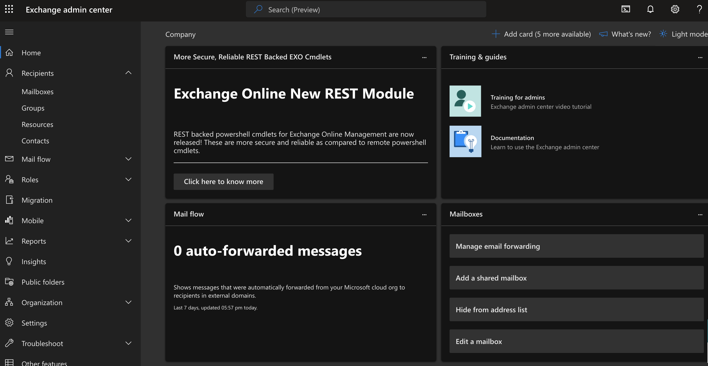
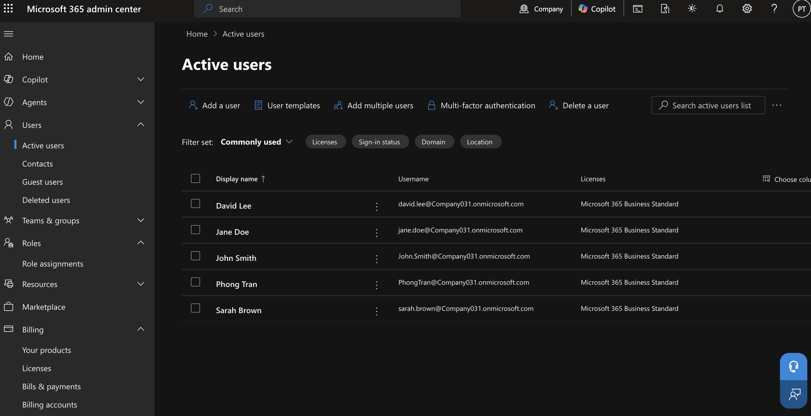
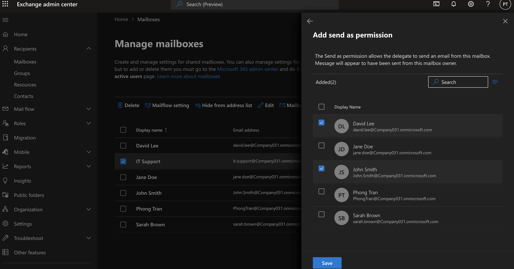
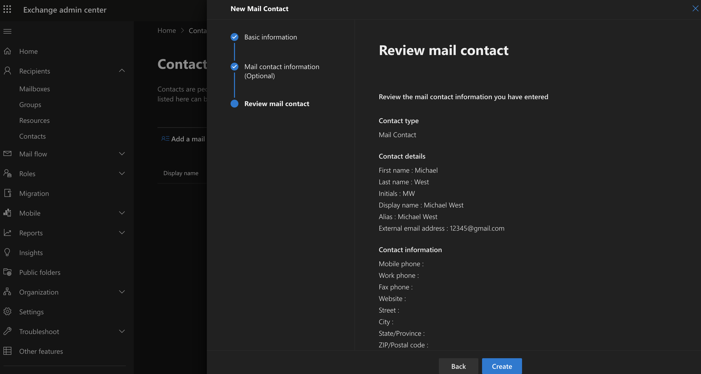
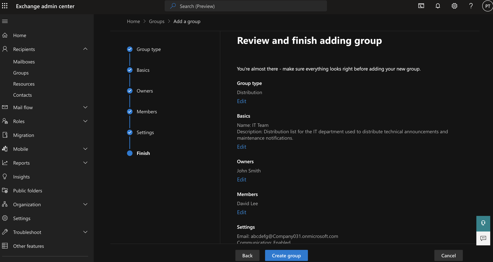
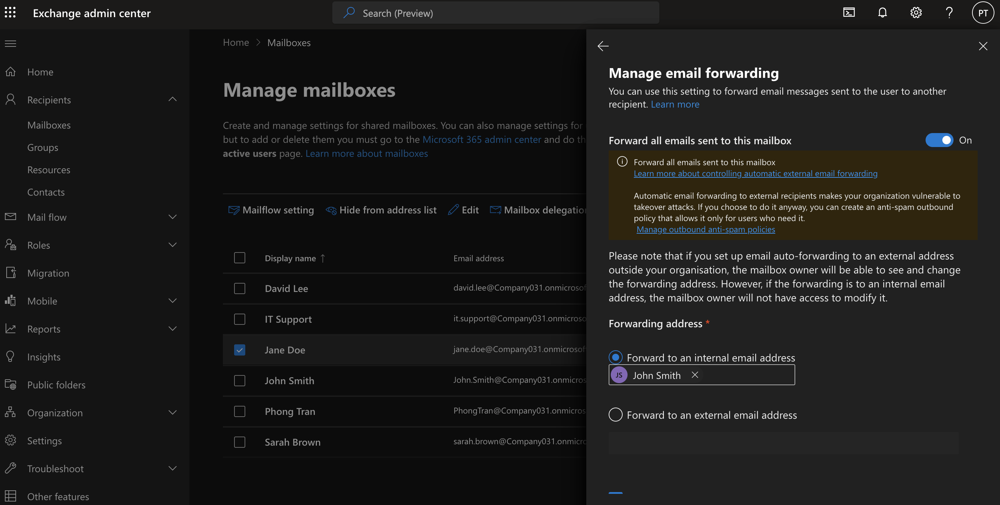
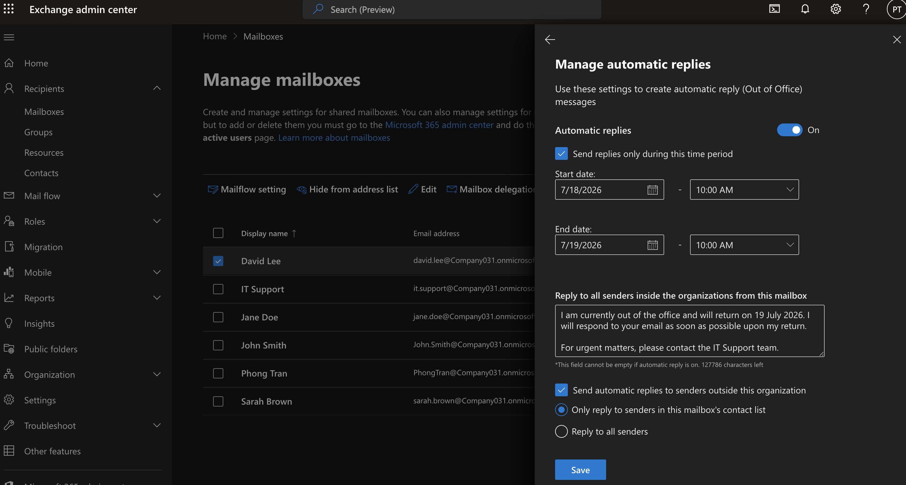
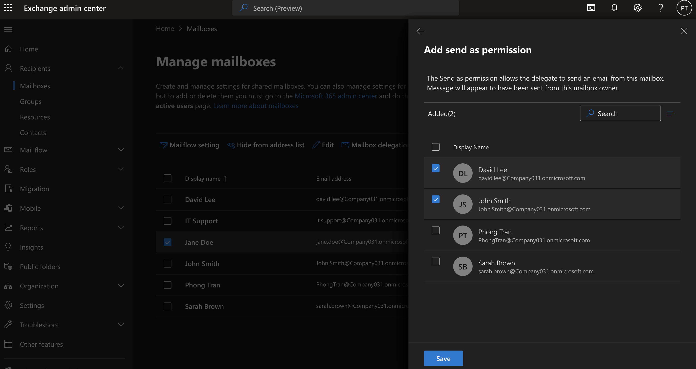
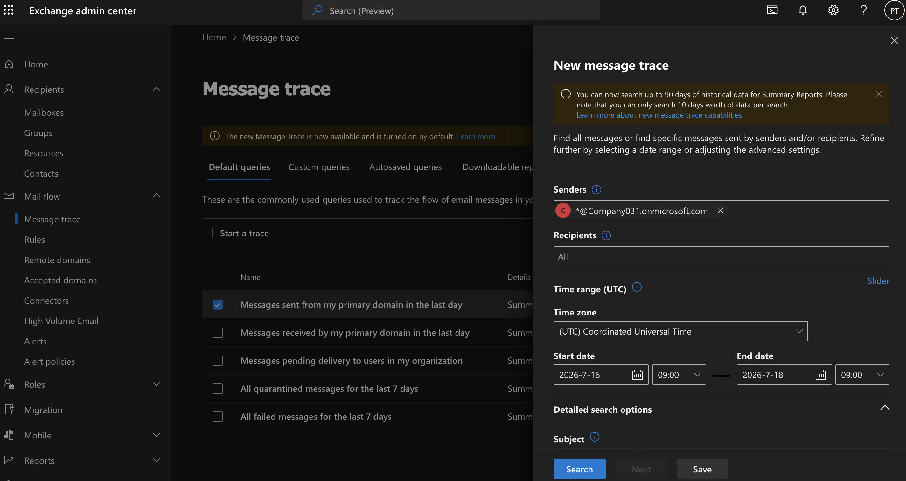

# Exchange Online

## Objective

This lab demonstrates how to perform common Microsoft Exchange Online administration tasks using the Exchange Admin Center.

---

## Steps

### 1. Access Exchange Admin Center

1. Sign in to the **Microsoft 365 Admin Center**.
2. Navigate to **Admin centers → Exchange**.
3. Verify that the **Exchange Admin Center** opens successfully.

### Verification

- Successfully accessed the Exchange Admin Center.
- Existing user mailboxes were visible.

---

### 2. Verify User Mailboxes

1. Navigate to **Recipients → Mailboxes**.
2. Confirm that licensed users have Exchange mailboxes.
3. Review mailbox properties including:
   - Email addresses
   - Mailbox usage
   - Mailbox delegation
   - Mail flow settings

### Verification

- User mailboxes were successfully displayed.
- Mailbox information was accessible.

---

### 3. Create a Shared Mailbox

1. Navigate to **Recipients → Mailboxes**.
2. Select **Add a shared mailbox**.
3. Create a shared mailbox named **IT Support**.
4. Assign **John Smith** and **David Lee** with **Full Access** and **Send As** permissions.

### Verification

- Shared mailbox **IT Support** was successfully created.
- Assigned users were granted mailbox access and Send As permissions.

---

### 4. Create a Mail Contact

1. Navigate to **Recipients → Contacts**.
2. Select **Add a mail contact**.
3. Create a contact using an external email address.
4. Save the configuration.

### Verification

- External mail contact appeared in the Contacts list.

---

### 5. Create a Distribution List

1. Navigate to **Recipients → Groups**.
2. Create a new **Distribution List** named **All Staff**.
3. Assign yourself as the owner.
4. Add multiple users as members.
5. Save the group.

### Verification

- Distribution List was created successfully.
- Members were added successfully.

---

### 6. Configure Mail Forwarding

1. Open a user mailbox.
2. Select **Mail flow settings**.
3. Configure email forwarding to another internal mailbox.
4. Save the configuration.

### Verification

- Mail forwarding was enabled successfully.
- Emails sent to the original mailbox were automatically forwarded to the destination mailbox.

---

### 7. Configure Automatic Replies

1. Open a user mailbox.
2. Select **Manage automatic replies**.
3. Enable **Automatic Replies**.
4. Configure the start and end dates.
5. Create an internal and external Out of Office message.
6. Save the configuration.

### Verification

- Automatic Replies were successfully enabled.
- Out of Office messages were configured for internal and external senders.

---

### 8. Configure Mailbox Delegation

1. Open the shared mailbox.
2. Select **Mailbox delegation**.
3. Assign **Full Access** permissions.
4. Assign **Send As** permissions.
5. Save the configuration.

### Verification

- Delegated users successfully received Full Access and Send As permissions.

---

## 9. Perform a Message Trace

1. Navigate to **Mail Flow → Message Trace**.
2. Search using the sender, recipient, or date range.
3. Review the delivery status and message details.

### Verification

- Message Trace successfully displayed email delivery information.
- Email delivery status could be reviewed for troubleshooting purposes.

