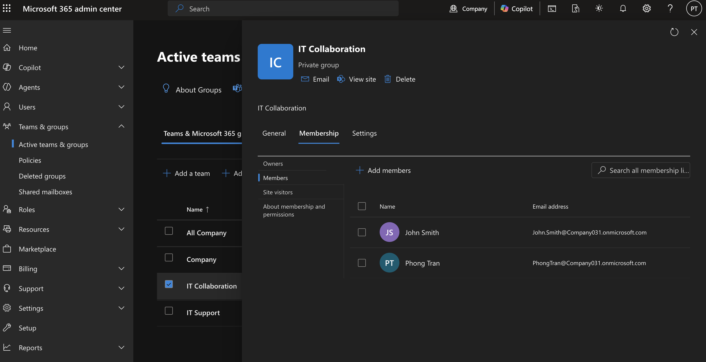

# SharePoint & OneDrive Administration

## Objective 

Demonstrate the administration of SharePoint Online and OneDrive by creating collaboration sites, managing permissions, configuring sharing policies, and organizing company documents.

---

# Business Scenario

ABC Manufacturing has expanded from 20 to 80 employees. Staff from Human Resources, Finance, and IT need a secure place to store documents and collaborate on projects.

As the Microsoft 365 Administrator, your responsibilities are to:

- Create collaboration sites for departments.
- Organize company documents.
- Assign appropriate permissions.
- Configure secure file sharing.
- Ensure users can access OneDrive for personal work files.
- Monitor storage usage and sharing policies.

---

# Tasks Performed

## Created a Team Site

Created a SharePoint Team Site named **IT Collaboration** to provide a central workspace for the IT department.

### Result

- Team Site created successfully.
- Microsoft 365 Group created automatically.
- Owners and Members assigned.

---

