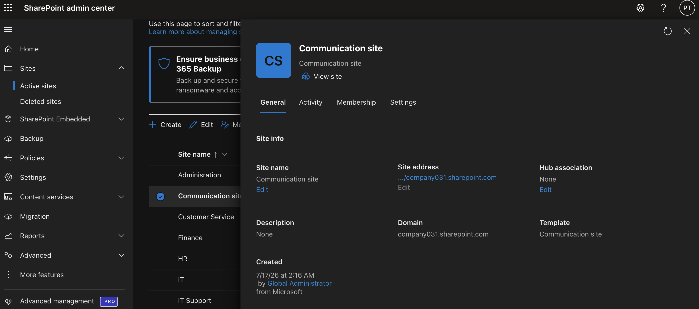
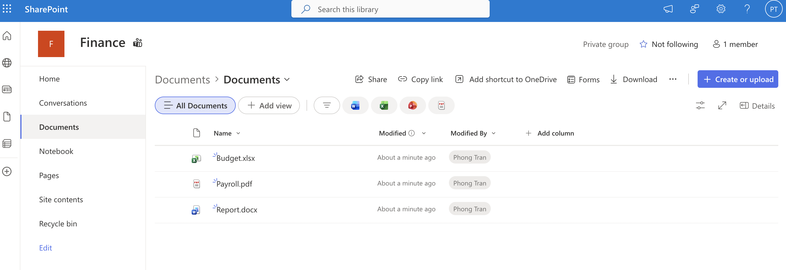
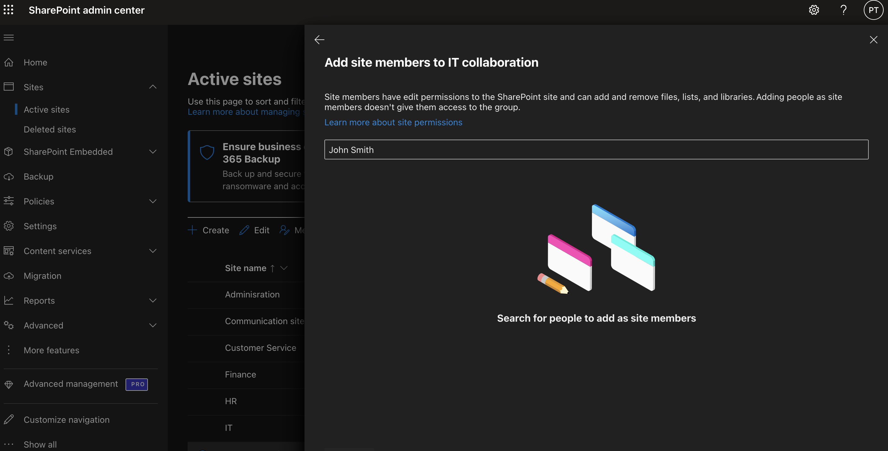
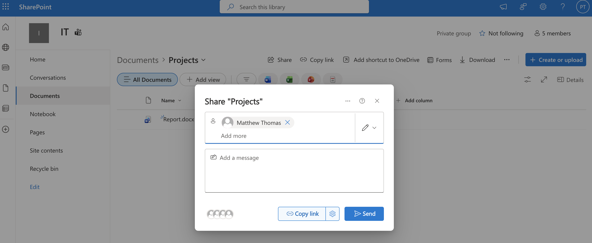
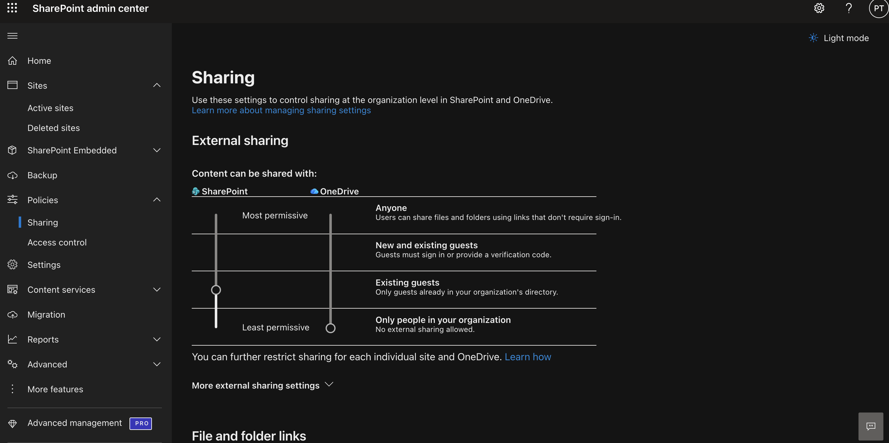
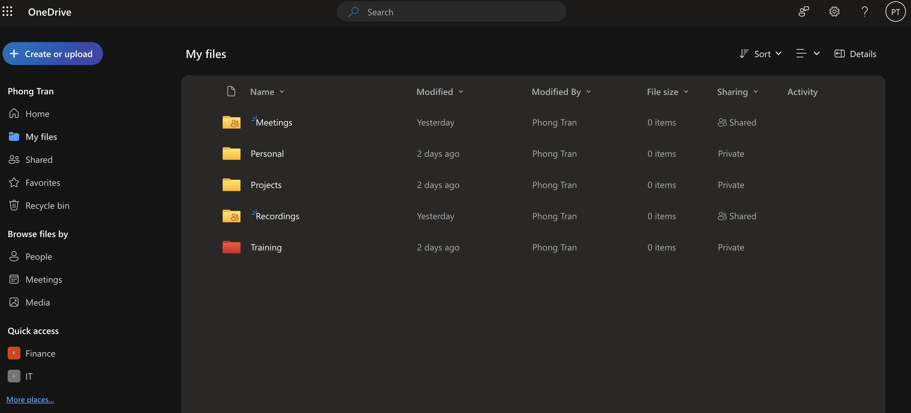
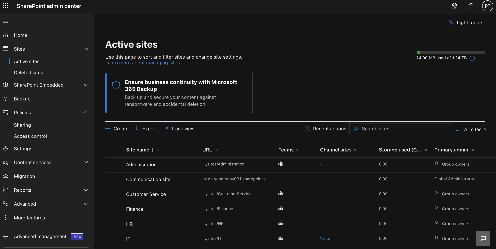

# Microsoft 365 SharePoint & OneDrive Administration

## Objective 

Demonstrate the administration of SharePoint Online and OneDrive by creating collaboration sites, managing permissions, configuring sharing policies, and organizing company documents.

---

## Business Scenario

The company has experienced rapid growth, with multiple departments collaborating on projects across different office locations.

To improve collaboration and centralize document storage, the company adopted Microsoft 365 SharePoint Online and OneDrive for Business.

As the Microsoft 365 Administrator, IT is responsible for creating collaboration sites, managing document permissions, configuring secure file sharing, monitoring storage usage, and ensuring employees have secure access to company files.

---

## Business Requirement

As the Microsoft 365 Administrator, your responsibilities are to:

- Create collaboration sites for departments.
- Organize company documents.
- Assign appropriate permissions.
- Configure secure file sharing.
- Ensure users can access OneDrive for personal work files.
- Monitor storage usage and sharing policies.

---

# Task 1 - Create an IT Collaboration Site

### Help Desk Ticket

**Ticket:** HD-4001

### Request

The IT department requested a dedicated SharePoint Team Site where technicians could collaborate, store documentation, and share project files.

### Actions Performed

- Created a SharePoint Team Site
- Configured the site as a Private Microsoft 365 Group
- Assigned site owners
- Verified site availability

### Business Value

Team Sites provide departments with a centralized workspace for collaboration, reducing reliance on local file storage and email attachments.

### Verification

- Team Site created successfully
- Site accessible by authorized users
- Microsoft 365 Group created automatically

---

# Task 2 - Create a Company Communication Site

### Help Desk Ticket

**Ticket:** HD-4002

### Request

Management requested a Communication Site to publish company news, policy updates, and internal announcements.

### Actions Performed

- Created a Communication Site
- Configured site information
- Verified site accessibility

### Business Value

Communication Sites provide employees with a centralized location for organization-wide announcements and important business updates.

### Verification

- Communication Site created successfully
- Site available to employees

---

# Task 3 - Organise Department Documents

### Help Desk Ticket

**Ticket:** HD-4003

### Request

Department managers requested a structured document library to organize business files for Human Resources, Finance, and IT.

### Actions Performed

- Created department folders
- Uploaded business documents
- Verified document availability
- Confirmed document library structure

### Business Value

Organized document libraries improve collaboration, simplify file management, and reduce time spent searching for information.

### Verification

- Folder structure created successfully
- Files uploaded successfully
- Documents accessible to authorized users

---

# Task 4 - Configure Site Permissions

### Help Desk Ticket

**Ticket:** HD-4004

### Request

A new IT Support Technician joined the department and required access to the IT Collaboration SharePoint site.

### Actions Performed

- Reviewed SharePoint permission groups
- Verified Owners, Members, and Visitors groups
- Added the technician to the Members group
- Confirmed inherited permissions

### Business Value

Managing access through SharePoint groups simplifies administration while ensuring employees receive the appropriate level of access based on their role.

### Verification

- User successfully added to the Members group
- Appropriate permissions applied

---

# Task 5 - Share Project Documents

### Help Desk Ticket

**Ticket:** HD-4005

### Request

The Infrastructure team requested secure access to a project document for collaborative editing.

### Actions Performed

- Shared the document with another employee
- Assigned Edit permissions
- Verified sharing configuration

### Business Value

Secure file sharing enables employees to collaborate on documents without creating duplicate copies while maintaining version history.

### Verification

- Document shared successfully
- Recipient granted appropriate permissions

---

# Task 6 - Review External Sharing Policy

### Help Desk Ticket

**Ticket:** HD-4006

### Request

The Information Security team requested verification that external file sharing complies with company security policies.

### Actions Performed

- Reviewed SharePoint sharing settings
- Reviewed OneDrive sharing settings
- Confirmed organization sharing configuration

### Business Value

Proper sharing policies reduce the risk of unauthorized data access while supporting secure collaboration with external partners.

### Verification

- Sharing policy reviewed successfully
- Organization sharing settings confirmed

---

# Task 7 - Verify OneDrive Access

### Help Desk Ticket

**Ticket:** HD-4007

### Request

A new employee requested confirmation that their OneDrive for Business account was provisioned and ready for storing work documents.

### Actions Performed

- Accessed OneDrive for Business through the Microsoft 365 portal.
- Verified that the personal OneDrive workspace was successfully provisioned.
- Created folders for organizing work documents.
- Confirmed OneDrive was ready for file storage and synchronization.

### Business Value

OneDrive provides employees with secure personal cloud storage, enabling access to work files from multiple devices while supporting backup and synchronization.

### Verification

- OneDrive opened successfully.
- Personal workspace was provisioned.
- Folders were created successfully.
- OneDrive ready for file uploads and synchronization

---

# Task 8 - Review SharePoint Storage Usage

### Help Desk Ticket

**Ticket:** HD-4008

### Request

IT Management requested a review of SharePoint storage usage to ensure departmental sites remained within available tenant capacity.

### Actions Performed

- Reviewed Active Sites
- Verified storage usage
- Confirmed site storage information
- Reviewed tenant storage allocation

### Business Value

Monitoring SharePoint storage helps administrators proactively manage capacity planning and avoid service disruptions caused by storage limitations.

### Verification

- Storage usage successfully reviewed
- Site operating within available storage capacity

---

# Key Takeaways

- SharePoint Online administration
- Team Site and Communication Site management
- Document library organization
- Permission and secure file sharing management
- OneDrive for Business administration
- SharePoint storage and sharing policy review
- Help desk ticket resolution and configuration verification

