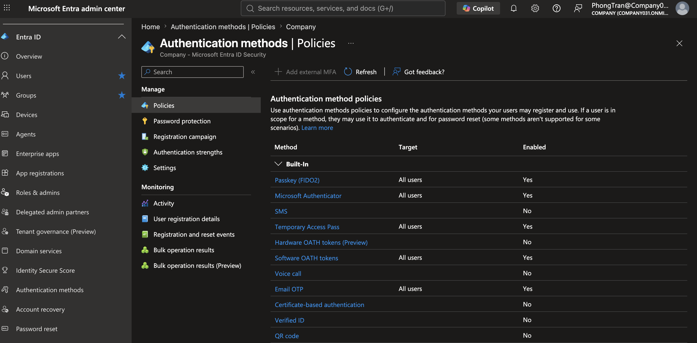

# Microsoft 365 Security

## Objective

Demonstrate how Microsoft 365 security features are configured to protect user identities, devices, email, and organizational data while reducing cybersecurity risks.

---

## Business Scenario

The company recently experienced an increase in phishing emails targeting employees. During a quarterly security review, management requested the IT department to strengthen Microsoft 365 security to better protect company accounts and sensitive business information.

---

## Business Requirement

- Enable Multi-Factor Authentication (MFA) for users
- Review Microsoft Secure Score recommendations
- Configure Security Defaults
- Monitor risky sign-in activity
- Review email protection policies
- Verify administrator security settings
- Improve the organization's overall security posture

---

# Task 1 - Review Microsoft Secure Score

### Help Desk Ticket

**Ticket:** HD-8001

**Request**

Management requested an assessment of the company's Microsoft 365 security posture and recommendations for improving protection against cyber threats.

### Actions Performed

- Opened Microsoft Defender Portal
- Reviewed the Microsoft Secure Score dashboard
- Identified recommended security improvements
- Recorded the current Secure Score
- Reviewed high-impact security recommendations

### Business Value

Secure Score provides measurable recommendations that help organizations reduce security risks and prioritize improvements based on Microsoft's security best practices.

### Verification

- Secure Score dashboard displayed
- Improvement actions available
- Security recommendations successfully reviewed

---

# Task 2 - Review Security Defaults

### Help Desk Ticket

**Ticket:** HD-8002

**Request**

The IT Manager requested verification that Microsoft's recommended baseline security settings were protecting all cloud identities.

### Actions Performed

- Opened Microsoft Entra Admin Center
- Reviewed Security Defaults configuration
- Confirmed baseline security protections were enabled

### Business Value

Security Defaults automatically enforce Microsoft's recommended identity protection settings without requiring complex configuration.

### Verification

- Security Defaults status displayed
- Baseline protections confirmed

---

# Task 3 - Review Multi-Factor Authentication (MFA)

### Help Desk Ticket

**Ticket:** HD-8003

**Request**

The IT Manager requested a review of the authentication methods available to employees to ensure only approved sign-in methods were enabled.

### Actions Performed

- Opened Microsoft Entra Admin Center
- Navigated to Protection → Authentication methods → Policies
- Reviewed available authentication methods
- Verified which methods were enabled for users
- Confirmed Microsoft Authenticator was available

### Business Value

Reviewing authentication method policies ensures users authenticate using approved methods while reducing the risk of weak or insecure authentication.

### Verification

- Authentication Methods Policies displayed
- Approved authentication methods reviewed
- Policy configuration successfully verified

