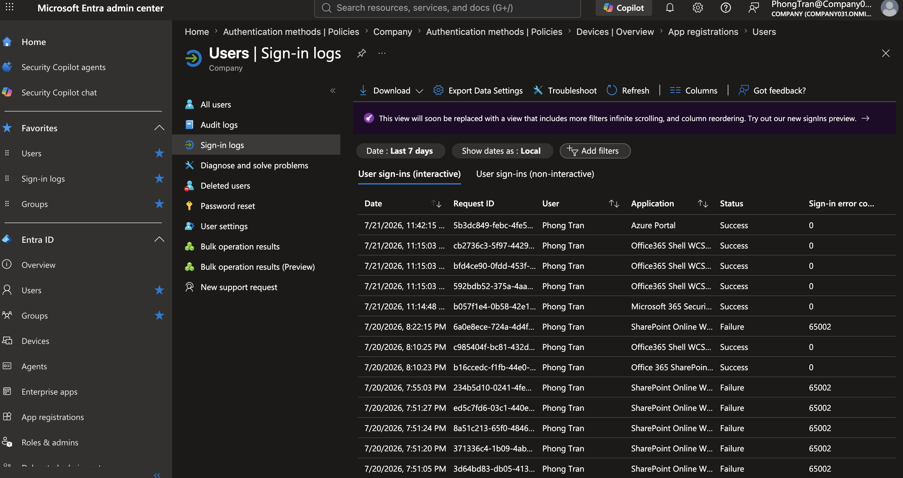
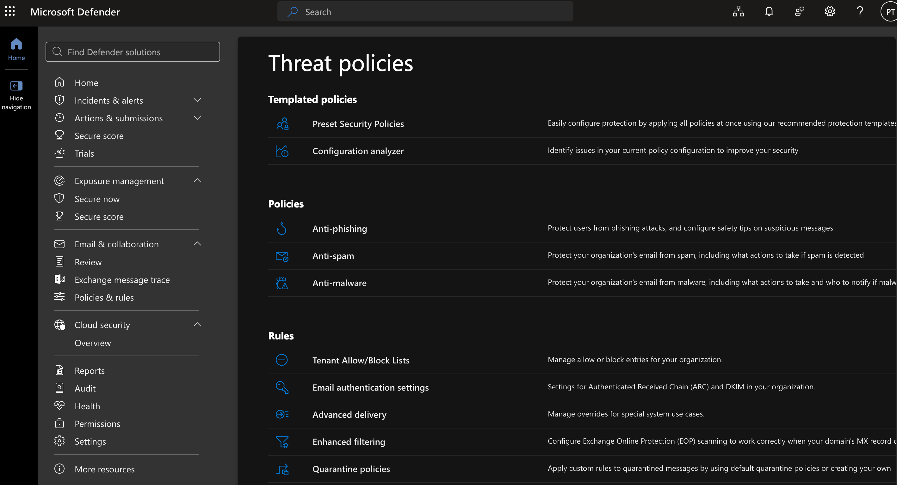
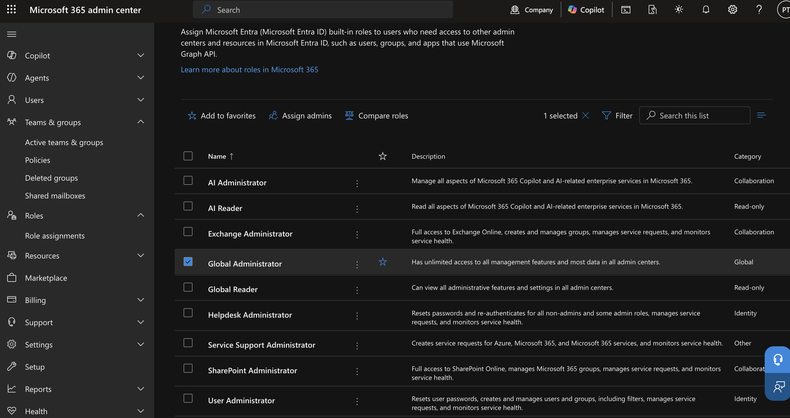
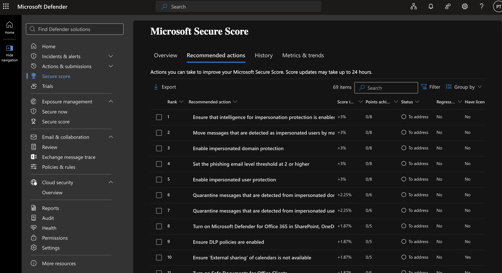

# Microsoft 365 Security

## Objective

Demonstrate how Microsoft 365 security features are configured to protect user identities, devices, email, and organizational data while reducing cybersecurity risks.

---

## Business Scenario

The company recently experienced an increase in phishing emails targeting employees. During a quarterly security review, management requested the IT department to strengthen Microsoft 365 security to better protect company accounts and sensitive business information.

---

## Business Requirement

- Enable Multi-Factor Authentication (MFA) for users
- Review Microsoft Secure Score recommendations
- Configure Security Defaults
- Monitor risky sign-in activity
- Review email protection policies
- Verify administrator security settings
- Improve the organization's overall security posture

---

# Task 1 - Review Microsoft Secure Score

### Help Desk Ticket

**Ticket:** HD-8001

**Request**

Management requested an assessment of the company's Microsoft 365 security posture and recommendations for improving protection against cyber threats.

### Actions Performed

- Opened Microsoft Defender Portal
- Reviewed the Microsoft Secure Score dashboard
- Identified recommended security improvements
- Recorded the current Secure Score
- Reviewed high-impact security recommendations

### Business Value

Secure Score provides measurable recommendations that help organizations reduce security risks and prioritize improvements based on Microsoft's security best practices.

### Verification

- Secure Score dashboard displayed
- Improvement actions available
- Security recommendations successfully reviewed

---

# Task 2 - Review Security Defaults

### Help Desk Ticket

**Ticket:** HD-8002

**Request**

The IT Manager requested verification that Microsoft's recommended baseline security settings were protecting all cloud identities.

### Actions Performed

- Opened Microsoft Entra Admin Center
- Reviewed Security Defaults configuration
- Confirmed baseline security protections were enabled

### Business Value

Security Defaults automatically enforce Microsoft's recommended identity protection settings without requiring complex configuration.

### Verification

- Security Defaults status displayed
- Baseline protections confirmed

---

# Task 3 - Review Multi-Factor Authentication (MFA)

### Help Desk Ticket

**Ticket:** HD-8003

**Request**

The IT Manager requested a review of the authentication methods available to employees to ensure only approved sign-in methods were enabled.

### Actions Performed

- Opened Microsoft Entra Admin Center
- Navigated to Protection → Authentication methods → Policies
- Reviewed available authentication methods
- Verified which methods were enabled for users
- Confirmed Microsoft Authenticator was available

### Business Value

Reviewing authentication method policies ensures users authenticate using approved methods while reducing the risk of weak or insecure authentication.

### Verification

- Authentication Methods Policies displayed
- Approved authentication methods reviewed
- Policy configuration successfully verified

---

# Task 4 - Review Sign-in Logs

### Help Desk Ticket

**Ticket:** HD-8004

**Request**

A user reported receiving unexpected Microsoft Authenticator notifications. IT investigated the account for suspicious sign-in activity.

### Actions Performed

- Opened Microsoft Entra Admin Center
- Reviewed Sign-in Logs
- Investigated recent authentication attempts
- Verified sign-in locations and authentication results
- Confirmed whether suspicious activity existed

### Business Value

Monitoring sign-in activity enables IT to quickly detect suspicious login attempts and respond before accounts are compromised.

### Verification

- Sign-in logs successfully reviewed
- Authentication history available
- No unauthorized activity identified

---

# Task 5 - Review Email Security Policies

### Help Desk Ticket

**Ticket:** HD-8005

**Request**

Employees reported an increase in phishing emails impersonating company executives. IT was asked to verify existing email protection policies.

### Actions Performed

- Opened Microsoft Defender Portal
- Reviewed anti-phishing policies
- Reviewed anti-spam policies
- Reviewed anti-malware policies
- Confirmed default protection settings

### Business Value

Email protection policies reduce malicious emails reaching employees, lowering the likelihood of phishing attacks, malware infections, and business email compromise.

### Verification

- Protection policies displayed
- Default policies enabled
- Email security settings successfully reviewed

---

# Task 6 - Review Administrator Roles

### Help Desk Ticket

**Ticket:** HD-8006

**Request**

As part of an internal audit, management requested verification that only authorized personnel possessed Global Administrator privileges.

### Actions Performed

- Opened Microsoft 365 Admin Center
- Reviewed administrator role assignments
- Verified Global Administrator accounts
- Confirmed privileged access aligned with business requirements

### Business Value

Applying the principle of least privilege reduces the risk of unauthorized administrative changes and limits the impact of compromised privileged accounts.

### Verification

- Administrator roles displayed
- Privileged accounts successfully reviewed

---

# Task 7 - Verify Security Configuration

### Help Desk Ticket

**Ticket:** HD-8007

**Request**

Following the quarterly security review, IT was asked to verify that all recommended security improvements had been successfully implemented.

### Actions Performed

- Reviewed Microsoft Secure Score
- Verified MFA configuration
- Confirmed Security Defaults
- Reviewed administrator assignments
- Verified security policies remained active

### Business Value

Verifying security configurations ensures implemented controls remain operational and continue protecting organizational resources against evolving threats.

### Verification

- Security controls confirmed
- Configuration changes successfully validated
- Security review completed

---

## Key Takeaways

- Reviewed the organisation's Microsoft Secure Score to assess its overall security posture and identify recommended improvements.
- Configured Security Defaults to enforce Microsoft's baseline identity protection and Multi-Factor Authentication (MFA).
- Reviewed Authentication Method Policies to verify approved sign-in methods available to users.
- Examined email protection policies within Microsoft Defender to understand how Microsoft 365 protects against phishing, spam, and malware.
- Reviewed administrator roles to ensure privileged access followed the principle of least privilege.
- Verified security configurations after implementation to confirm policies were active and functioning as expected.

