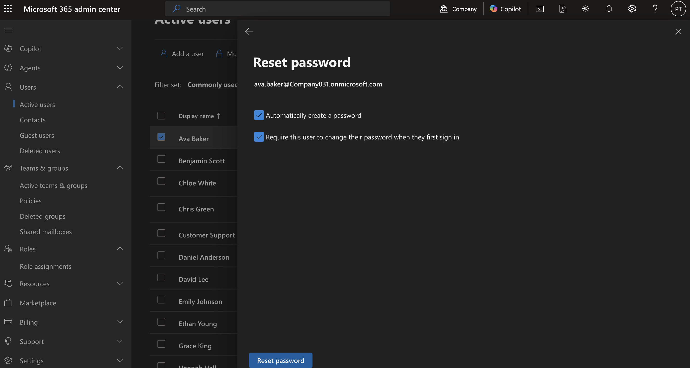
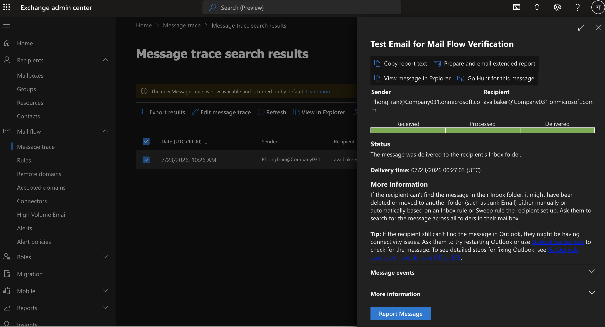

# Microsoft 365 Troubleshooting 

## Objective

Demonstrate how common Microsoft 365 administrative issues are investigated, diagnosed, and resolved to minimize business disruption and restore user productivity.

---

## Business Scenario

The comapany relies on Microsoft 365 for daily operations, including email, Microsoft Teams, SharePoint, and device management. Throughout the workday, employees reported several technical issues affecting their ability to work.

The IT Help Desk was responsible for investigating each incident, identifying the root cause, restoring services, and documenting the resolution for future reference.

---

## Business Requirement

- Resolve user authentication issues
- Restore access to Exchange Online mailboxes
- Fix Microsoft Teams sign-in problems
- Resolve SharePoint permission issues
- Verify services were fully restored
- Document resolutions to improve future incident response

---

# Task 1 - User Unable to Sign In

### Help Desk Ticket

**Ticket:** HD-3001

**Request**

A finance employee reported that they were unable to sign in to Microsoft 365 despite entering the correct password. The employee needed immediate access to Outlook and Teams before an important client meeting.

| Name | Department | Job Title |
|-------|------------|-----------|
| Ava Baker | Finance | Accounts Payable Officer |

### Actions Performed

- Verified the user account existed in Microsoft Entra ID.
- Confirmed the account was not blocked or disabled.
- Reviewed recent sign-in activity.
- Reset the user's password.
- Confirmed successful login after the password reset.

### Business Value

Restoring account access quickly minimizes downtime and ensures employees can continue performing business-critical tasks.

### Verification

- User successfully signed in.
- Outlook mailbox accessible.
- Microsoft Teams opened successfully.

---

# Task 2 - User Not Receiving Email

### Help Desk Ticket

**Ticket:** HD-3002

**Request**

A sales employee reported that customers were sending emails, but nothing was appearing in their inbox.

### Actions Performed

- Verified the mailbox status in Exchange Admin Center.
- Confirmed a Microsoft 365 license was assigned.
- Reviewed Message Trace.
- Checked for mailbox rules.
- Confirmed mail flow resumed normally.

### Business Value

Email outages can delay customer communication, resulting in lost business opportunities and reduced customer satisfaction.

### Verification

- Test email delivered successfully.
- Message Trace showed successful delivery.
- User confirmed emails were received.

