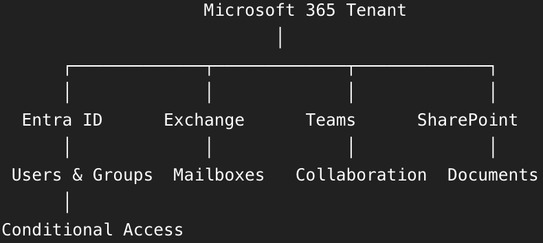
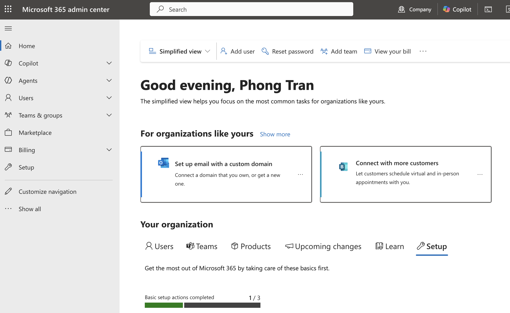
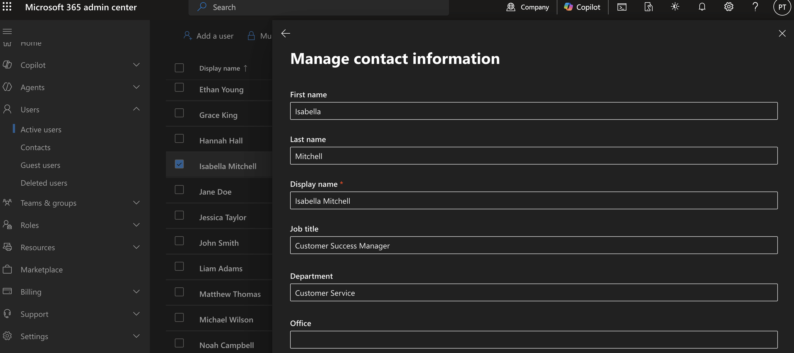
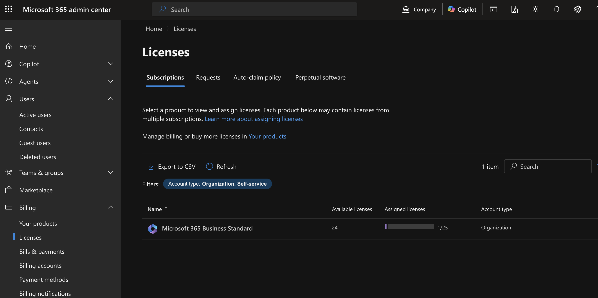
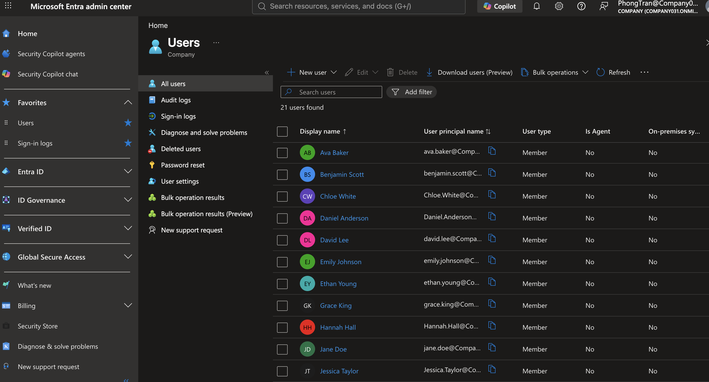
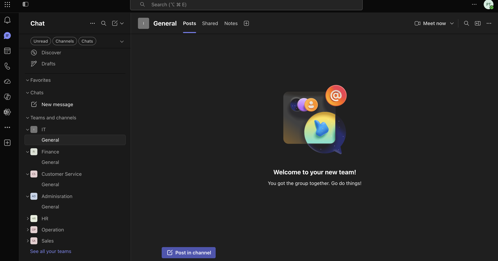
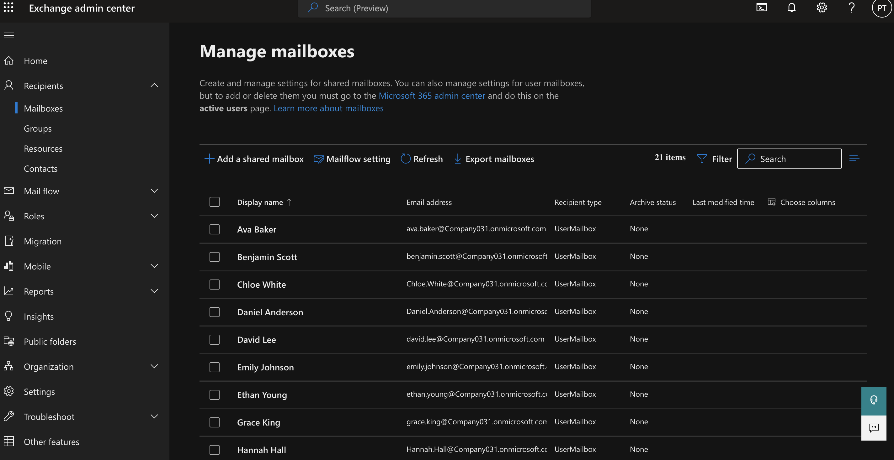
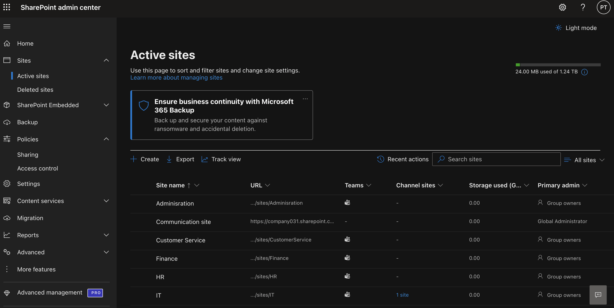
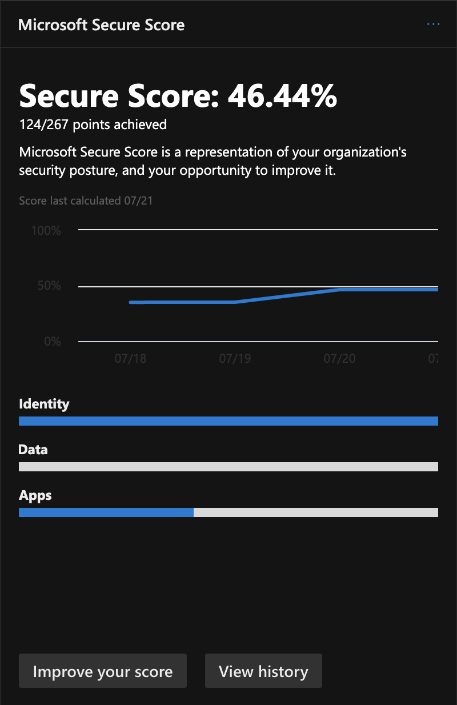

# Microsoft 365 Administration Lab

A hands-on Microsoft 365 Administration project that simulates the day-to-day responsibilities of an IT Support, Microsoft 365 Administrator, or Systems Administrator.

The objective is to demonstrate practical administration skills across Microsoft 365 services including Microsoft Entra ID, Exchange Online, Microsoft Teams, SharePoint Online, OneDrive, and Security.



---

## Objectives

- Deploy and configure a Microsoft 365 tenant
- Create and manage user accounts
- Assign and manage Microsoft 365 licenses
- Configure Microsoft Entra ID identities
- Administer Microsoft Teams
- Manage Exchange Online mailboxes
- Configure SharePoint Online and OneDrive
- Apply Microsoft 365 security controls
- Implement Conditional Access policies
- Troubleshoot common Microsoft 365 issues

---

## Lab Environment

| Component | Details |
|----------|---------|
| **Platform** | Microsoft 365 Business |
| **Identity** | Microsoft Entra ID |
| **Email** | Exchange Online |
| **Collaboration** | Microsoft Teams |
| **Storage** | SharePoint Online & OneDrive |

---

## Project Structure

```
01-Tenant-Setup
02-User-Management
03-License-Management
04-Microsoft-Entra-ID
05-Microsoft-Teams
06-Exchange-Online
07-SharePoint-OneDrive
08-Security
09-Troubleshooting
10-Microsoft-Diagram
```

---

## Project Highlights

### Tenant Setup 

Configured a Microsoft 365 tenant, verified organizational settings, and explored the Microsoft 365 Admin Center to establish the cloud administration environment.



--- 

### User Management

Created and managed Microsoft 365 user accounts, assigned administrative roles, reset passwords, and updated user profile information through the Microsoft 365 Admin Center.



--- 

### License Management

Assigned and managed Microsoft 365 licenses, monitored license availability, and ensured users received the correct Microsoft services based on their assigned licenses.



--- 

### Microsoft Entra ID

Managed identities using Microsoft Entra ID, explored users, groups, and administrative roles, and gained experience with cloud-based identity and access management.



--- 

### Microsoft Teams

Configured Microsoft Teams settings, created teams and channels, managed members, and explored collaboration and communication features.



---

### Exchange Online

Administered Exchange Online mailboxes, configured mail flow settings, managed recipients, and explored message trace and email administration features.



---

### SharePoint & OneDrive

Explored SharePoint Online sites and OneDrive administration, managed permissions, reviewed storage settings, and gained experience with Microsoft 365 file collaboration.



---

### Security

Explored Microsoft 365 security features including Microsoft Defender, Secure Score, Multi-Factor Authentication (MFA), and security recommendations to improve organizational protection.

